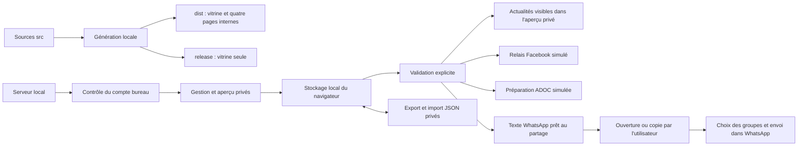

# Architecture

## Raccordement du cockpit aux lots — 6 octobre

`framework-iterations.mjs` lit les suivis canoniques explicitement déclarés au
lancement. La même source porte les événements du lot ; aucune base parallèle
de pilotage n'est créée. Le candidat, le manifeste Git, les empreintes du paquet
et la PR sont vérifiés, les preuves attachées au même candidat. Les événements
de validation dépendent des décisions précédentes exactes ; leur remplacement
ou une correction les rend historiques sans les effacer. La dernière phase
exige un accord et une livraison de production attestés séparément.

Les sources de revue et celles du candidat peuvent être séparées par le
raccordement privé `candidateRoots` : la vérification utilise le manifeste
et le vérificateur natif de la copie candidate explicitement déclarée au lancement,
alors que les événements restent dans le suivi opérationnel. Aucun chemin reçu
par HTTP ou déduit du champ `worktree` du suivi n’est exécuté.

`framework-iterations-ui.mjs` présente les versions et les trois décisions ;
les commentaires et critères sont conservés dans la session de l'onglet,
sans conserver une confirmation personnelle après rechargement. Le serveur
reste en boucle locale avec contrôle d'origine et de jeton, écritures sérialisées,
contrôle de révision et sauvegarde privée. Le moteur historique reste accessible
et ses données sont préservées. Voir le [guide](docs/piloter-versions.md).

## Réunion des contrôles V1 et V2 — 7 octobre

La CI conserve quatre jobs techniques : `delivery-safety` pour les archives
et la syntaxe PHP, `drupal-mysql` pour la recette V2/MariaDB, `support-runtime`
pour le formulaire V1 et `technical-ci` pour les constructions, les tests et
le candidat Git. Les deux runtimes utilisent chacun le checkout jetable de
leur runner. Les permissions de lecture, les actions épinglées et le contrôle
de politique humaine sont conservés. Le YAML exécutable et son contrat de test
font autorité ; voir la [résolution de la PR #15](docs/resolution-conflits-pr15.md).

## Édition native et correctif V1 du 6 octobre

`tcl_site` rattache sept modèles de pages à des contenus `tcl_public_page`.
La base Drupal porte les textes édités et leurs révisions ; les HTML gardent
la présentation et les fonctions. Un widget à champs nommés stocke les rubriques
dans `field_tcl_textes`, sans HTML libre. Le rendu conserve les régions non éditées
et vérifie l'empreinte du modèle avant substitution. Voir [l'édition Drupal](docs/modifier-textes-drupal.md).
Le paquet additionnel support/édition n'inclut pas core, vendor, base ou secrets.
Les outils hébergés restent hors webroot, vérifient les empreintes et limitent
les écritures à la préproduction TC, avec restauration privée qualifiée avant application.

## Signalements V1 et suivi privé — 6 octobre

Le module Drupal `tcl_support` ajoute le bouton aux réponses des sept pages
servies par `tcl_site`, sans modifier manuellement les HTML générés. Le
formulaire natif enregistre d'abord une demande dans `tcl_support_request` ;
`tcl_support_event` conserve ensuite ses traitements et notifications.
Le suivi paginé et les coordonnées exigent la permission restreinte du
module. Les vues utilisent des textes échappés, des sessions et un cache
privé ; les demandes ne sont ni exportées en configuration ni publiées en
issues GitHub. Le formulaire anonyme possède un jeton lié à sa session,
un champ piège et une limite de soumission.

Le seul message `tcl_support_report` utilise `test_mail_collector` en local.
Les autres courriels restent neutralisés. Le modèle hébergé ferme le
formulaire et son transport par défaut. Le correctif dispose d'une base
SQLite propre et d'un serveur boucle locale sur 4183 ; un suffixe de session
propre au checkout évite les collisions avec d'autres développements.
La boîte support existe ; son transport et les mentions de collecte restent
à qualifier. Les détails et limites sont dans [le guide support](docs/signalements-support.md).

## V2 locale — comptes et Bureau

Le module [tcl_bureau](drupal/web/modules/custom/tcl_bureau/tcl_bureau.info.yml)
complète `tcl_site` avec comptes, sessions et formulaires Drupal. Le schéma
définit une table de dossiers d'adhésion, avec identité/saison unique, état,
détails privés, auteur et révision. Deux tables d'équipes/attributions restent
conservées pour la suite, avec `teams_enabled: false`. La base de recette est
un SQLite neuf dans `.local/drupal-runtime/`, distinct des bases hébergées.
Comptes et rôles sont relus avant accès et écriture ; les formulaires contrôlent
CSRF, doublons et révision avant une mise à jour atomique. Les valeurs sont
restituées comme texte. Aucun dossier n'est stocké dans le navigateur.
Le [guide du lot](docs/comptes-et-bureau.md) détaille règles et recette.

La [communication V2](docs/communication-bureau.md) ajoute `tcl_bureau_post` :
contenu, copie JPEG, auteur/date, révision et validation. Le service serveur
compare atomiquement la révision pour enregistrer, valider, publier, retirer,
archiver ou restaurer. Modifier un contenu le remet en brouillon. Les routes
publiques lisent uniquement une révision publiée et validée ; les images privées
passent par le contrôle Bureau. L'accueil reçoit les actualités via le contrôleur
V2, sans modifier les pages immuables V1. Les liens externes sont préparés après
validation, sans service de diffusion automatique. Le helper d'update est borné
au SQLite local. Une fixture MariaDB distincte qualifie maintenant installation
additive, update native `11001`, révisions et octets JPEG : voir la
[recette](docs/recette-bureau-mysql.md). La cible hébergée reste à recetter.

Les helpers CLI, hors de `web/`, refusent toute base hébergée. L'installation
du module seule crée le schéma/rôles sans compte ni donnée fictive. Le menu
Espace est raccordé uniquement lorsque ce module est activé. Le test MariaDB
utilise un multisite jetable, un serveur autonome lié à `127.0.0.1:33080`, des
bases nouvelles et un réglage privé ; le bootstrap SQLite conserve son refus
de MySQL. Le serveur de test est arrêté en fin de recette. Aucun outil de
première installation n'est appliqué à une base hébergée existante.
Les observations [FFT](api/fft.md) sont documentaires : aucune API ni
synchronisation automatique ADOC/Ten’Up n'est raccordée à ces dossiers.
Le calendrier est affiché depuis un cadre Google limité à `calendar.google.com`,
sur la page Calendrier, après configuration d'un ID public et revue du partage.
Le générateur et les aperçus contrôlent cette source ; aucune clé API ni
identification Google n'est enregistrée. L'agenda n'étant pas qualifié, son ID
reste vide et aucun cadre n'est chargé dans les pages actuelles.

## Livraison reproductible — 5 octobre

La chaîne TC réutilise la préparation manuelle issue du site Drupal AVEREO.
Le constructeur `prepare_delivery.py` publie un ZIP vérifié sans écraser un
candidat existant. L'opération `verify-receipt` lie le reçu CI aux octets du
ZIP, au manifeste et à la source propre. Les tests Linux des archives et de
la première installation entrent dans les PR ; la syntaxe PHP du code propre
au club est également contrôlée. Aucun déploiement n'est déclenché par merge.

Les paramètres, comptes, fichiers de fonctionnement et bases restent hors du
paquet. Préproduction et production doivent garder des bases et racines
distinctes. Le même ZIP est préparé sous
`tcl-production/releases/14c270431af12397/drupal/` ; son sous-répertoire
`web` sert désormais `tclongages.fr` et `www`.
La base dédiée `daje5127_tclprod` reçoit les 43 tables de la sauvegarde
vérifiée après contrôle de sa vacuité et de ses dix droits. Le mot de passe
reste hors racine web. Le certificat officiel, initialement autosigné, est
remplacé par un certificat gratuit reconnu sur le domaine et `www`.
La copie restaurée démarre en français sous maintenance. La production est
ouverte après qualification HTTP/PHP et retour réel à `public_html`. Sa base
conserve les données restaurées ; une table de cache Drupal a été créée lors
de la reconstruction native des caches. Les pages viennent du ZIP immuable.
La configuration [Apache de production](config/production-https.htaccess)
est superposée au `.htaccess` original vérifié : HTTPS, refus des fichiers
privés et retrait de non-indexation uniquement pour une réponse 200 sur les
chemins publics explicitement autorisés. Son drapeau Apache est activé avec
le drapeau PHP lors de l'ouverture et remis à zéro lors de la fermeture.
Les paramètres restent hors webroot en 0600 ; `vendor` reste hors de la
racine publique. Le [reçu de publication](data/industrialisation-verification.json#publication)
sépare l'identité du ZIP de celle de la configuration hébergée.
Les outils de préparation et restauration
refusent l'écrasement d'une version ou d'une base existante. L'adaptateur de
mise à jour récurrent reste à qualifier. Les versions futures préserveront
les données de production et appliqueront les migrations examinées.

## Compte principal TC et première installation — 4 octobre

La préproduction est configurée dans le compte du domaine officiel, suivant
le choix humain et le lot explicite [décrits dans le plan](docs/preparer-lune-tc.md).
`tcl-preproduction/drupal/web` est la seule racine Web de cet hôte ; Composer,
les dépendances et pages dérivées sont dans son parent. Le dossier
`tcl-preproduction/private`, hors webroot et en `0700`, conserve les preuves
de qualification et les paramètres privés de l’installation autorisée.
Fichiers et base sont séparés de la production ; les comptes et le PHP sont
partagés. La Lune antérieure reste conservée.

PHP CLI et HTTP répondent 8.3.33 avec les 18 extensions attendues. Le certificat
de la seule préproduction est émis par DNS-01. Drupal 11.4.8 est installé sur
la base dédiée MariaDB 11.4.13, en UTF-8/InnoDB ; sa connexion applicative a
réussi après synchronisation du paramètre privé. Apache charge les règles du
candidat et les protections d’installation ; la maintenance Drupal ferme les
pages publiques. La connexion native répond 200 en HTTPS, les neuf routes
publiques contrôlées répondent 503 avec non-indexation. Les sondes restent en
privé. Le [reçu d’installation](data/framework-revue-verification.json#primaryAccountFirstInstallation)
conserve l’identité du ZIP, les paramètres de fermeture et la recette anonyme.

Les modules natifs `language` et `locale`, avec leur dépendance `file`, sont
activés pour la traduction. Le français est la langue par défaut ; la détection
de l’interface utilise la langue sélectionnée, sans préfixe d’URL obligatoire.
Les traductions importées et la configuration linguistique résident dans
l’installation Drupal et sa base, séparément des pages V1 du ZIP. Le site de
recette est l’accueil de la préproduction ; le cockpit reste local au poste.

L’[adaptateur](scripts/first_install.py) réutilise le vérificateur du ZIP reçu,
exige le rôle du compte principal TC et lie sept champs d’identité du reçu
au profil privé. Il refuse la Lune, les hôtes officiels ou techniques et les
preuves d’un autre compte. Extraction privée, conservation de la racine vide,
installation PHP fermée et contrôle dans un processus neuf sont exécutés pour
le lot autorisé. La [procédure](docs/installation-drupal.md) précise la saisie
humaine, la maintenance et les limites. Aucun nouvel accès SSH n’est créé.
Les inventaires datés suivants restent historiques.

## Compte isolé actif et chaîne de préparation — 3 octobre

La première lune gratuite dédiée à la préproduction TC est active ; l'accès à son cPanel séparé est confirmé. Le domaine officiel conserve son compte actuel. Le lot de configuration a été autorisé et partiellement réalisé : PHP 8.3 appliqué, racine isolée créée avec fermeture Apache relue, base vide UTF-8 et utilisateur SQL dédié avec dix droits enregistrés. cPanel refuse `preprod.tclongages.fr` dans la lune parce que son domaine parent appartient au compte principal. Aucun DNS ni certificat n’est créé pour ce nom. Une adresse temporaire de la lune est proposée, non soumise ; son accord, DNS, HTTPS reconnu et PHP réellement servi restent à qualifier. Les détails de compte demeurent privés ; le [reçu](data/activation-lune-verification.json) porte l'état vérifié et les limites des restaurations de fichiers.

L'Action GitHub a construit et vérifié le candidat non configuré sur le commit fusionné de la PR #5. L'archive reçue et son manifeste ont été relus sur le poste, sans reconstruction. Le [reçu de préparation](data/actions-mutualisees-verification.json) identifie le même artefact à conserver pour la prochaine qualification. Le protocole GitHub et cockpit est raccordé au bloc `developmentWorkflow` du [suivi existant](docs/suivi-chantier/suivi-chantier.json), sans second historique de décisions ni nouvelle interface.

Les sections datées du 1er octobre ci-dessous conservent l'état antérieur à cette activation.

## Composants de préparation partagés — 1er octobre

La demande de réutiliser les Actions du site Drupal AVEREO est traitée par une [bibliothèque générique et une Action SSH paramétrée](workflows/preparer-livraison.md), sans modifier AVEREO ni hériter de ses secrets. Le constructeur produit un candidat Drupal non configuré et vérifie son inventaire exhaustif. La qualification SSH exige un environnement TC distinct et n'effectue aucun transfert. Sauvegarde initiale, restauration réelle, configuration privée, recette hébergée, livraison et ouverture restent à qualifier séparément ; l'adaptateur de première installation n'est pas implémenté. Aucune réussite de préparation ne vaut mise en production.

Le [reçu d'hébergement](data/activation-lune-verification.json) qualifie désormais la sauvegarde des fichiers du compte actuel et de sa racine publique fraîche, restaurés en copie privée locale. Les exports DNS et certificats sont conservés et leurs fichiers vérifiés ; leur réinstallation dans cPanel n'est pas testée. La création de la lune isolée attend la saisie personnelle du nouveau mot de passe. Aucun compte Drupal hébergé, base, runtime compatible ou accès SSH TC n'est qualifié par cette sauvegarde.

## Parcours de livraison V1

`scripts/build-hosting-probe.mjs` dérive une sonde PHP de `drupal/composer.lock`, avec le pilote SQL de la cible. Son dossier local de qualification reste distinct du candidat Drupal ; seul le sous-dossier `web/` serait déposé lors d'un test autorisé, avec refus Apache par défaut. Le [guide de qualification](docs/qualification-preproduction.md) précise cette frontière et le retour à la fermeture.

Le [suivi canonique](docs/suivi-chantier/suivi-chantier.json) présente quatre phases communes. Il conserve les huit anciennes phases en instantané avec leur mapping. Le [registre opérationnel](data/parcours-mise-en-ligne.json) référence ces phases ; il conserve les reçus de livraison sans maintenir un second statut de revue. Il documente cette livraison sans ajouter de page au serveur local de suivi. Le dossier de pages `.local/drupal-public-candidate/` est dérivé des sources V1 par `scripts/build-drupal-public-pages.mjs` et reste ignoré par Git. Les décisions de revue historiques demeurent dans `docs/suivi-chantier/suivi-chantier.json`.

Le module Drupal sert les pages hors webroot. Son abonné de réponse bloque l'indexation par défaut ; un drapeau explicite ne retire ce blocage que sur les chemins publics et réponses 200. La maintenance, les erreurs et la connexion restent non indexables. Les installations préproduction et production nécessitent bases, répertoires privés, paramètres et contrôles distincts ; aucune de ces installations n'est créée par le dépôt.

## Couche de pilotage locale — 29 septembre

Le [profil](framework/profil-projet.json) décrit les environnements ; le [suivi JSON](docs/suivi-chantier/suivi-chantier.json) porte phases, commentaires et décisions. `framework-server.mjs` sert l'interface sur 127.0.0.1:4181 ; `framework-store.mjs` contrôle les transitions et écrit atomiquement le suivi avec sauvegarde et historique. La révision couvre profil, suivi, documents et configuration d'installation. Une requête obsolète reçoit 409 ; son brouillon reste disponible dans l'interface. Host, Origin, jeton temporaire et boucle locale limitent les accès. L'identité est déclarée, sans authentification distante.

`scripts/framework.mjs` valide et génère les vues Markdown/HTML de lecture. Le serveur régénère ces vues après une mutation ; elles ne sont pas une seconde source. [Installation et usage](docs/installation-framework.md) décrit les actions de revue des phases locales 0 et 1. Les phases de livraison restent sans adaptateur opérationnel ; aucun bouton ne déploie ou n'ouvre le site. La dérogation temporaire est bornée par `framework/installation.json`, distincte des protections de confidentialité et de publication conservées.

Le [manifeste du candidat](docs/candidat-revue.md) rattache la revue à un commit source. Les modifications des sources rendent les preuves périmées ; les écritures de suivi et reçus sont exclues selon une liste fermée. Les workflows `technical-ci` et `policy` exécutent respectivement les tests et la vérification stricte de la description de PR. Ils ne disposent d’aucun accès d’hébergement.

Le tableau interactif affiche les PR explicitement associées à chaque phase dans le suivi JSON. Son service local lit en lecture seule leurs états publics sur l’API GitHub, met le résultat en cache et indique si la lecture est indisponible. La liste générale reste informative. Un contrôle séparé du détail de la PR candidate bloque la validation en l’absence de fusion exacte ; il ne coche aucun critère ni ne crée de décision humaine. L’[intégration GitHub du suivi](api/github-suivi.md) décrit cette frontière.

La garde Fetch Metadata autorise une navigation humaine de premier niveau vers `GET /` (mode `navigate`, destination `document`, activation `?1`) depuis une page externe pour ouvrir le suivi existant. Cette exception ne s’applique ni aux API, ni aux écritures, ni à l’historique ; les vérifications Host/Origin restent préalables et les pages ne peuvent pas être incorporées dans une iframe.

## Drupal dédié local

Le socle `drupal/` utilise Drupal 11.4.8, Drush 13.8.0 et son verrou Composer. La racine publique est `drupal/web/`. Le module propre `tcl_site` lit les sept pages dérivées dans `drupal/site-pages/`, hors racine publique, et les sert via Drupal : aucun HTML autonome ne contourne la maintenance. `system.maintenance_mode` commande la fermeture native ; le message se configure depuis l'administration. Les anciens ZIP statiques gardent leur mécanisme historique.

PHP utilise un fichier INI privé au projet ; SQLite, fichiers privés et identifiants de recette sont sous `.local/`, exclus du versionnage. Le transport de courrier local est neutralisé, l'inscription libre est fermée et le serveur écoute seulement 127.0.0.1:4182. L'accès administrateur CMS local ne réalise pas encore les rôles métier Admin/Bureau/Capitaine ni l'authentification du suivi. L'hébergement, sa base et ses sauvegardes restent à qualifier selon [l'installation Drupal](docs/installation-drupal.md). La configuration `config/officiel.json` décrit toujours la variante statique et ses intégrations en attente.

## Variante officielle V1 — intégration du 24 septembre

Le cadrage courant est décrit dans [l'intégration officielle](docs/integration-officiel.md). Il distingue une vitrine légère, un futur espace Admin/Bureau/Capitaine avec contrôle serveur par équipe et des services Google externes : Calendar pour les rencontres, Forms pour les réponses Oui/Non/Je ne sais pas et Sheets pour les effectifs et le pilotage réservé. Ces services ne sont pas encore connectés. Une liste contrôlée de joueurs dans un Form n'est pas une authentification du joueur ; elle ne doit pas exposer la liste générale des adhérents.

`src/index.html` reste la source commune de la vitrine. Les compléments `src/officiel*` et `config/officiel.json` préparent une sortie distincte `officiel/`, générée par `scripts/build-officiel.mjs` et consultable localement sur le port 4180. La configuration centralise l'identité, les liens publics et les emplacements vides des ressources Google, sans secret ni effectif privé. `club.email` est aussi la source unique du contact de toutes les variantes : `src/index.html` contient `{{CLUB_EMAIL}}`, résolu et échappé par `scripts/inline-html.mjs`. `contact.testSupport` conserve l'adresse et le statut `planned` ; seule la page Contact officielle la présente en texte, sans `mailto:`, et oriente les demandes vers le contact principal. Le validateur refuse de présenter ce support comme activé. Le domaine futur est `tclongages.fr` ; `tclongages@gmail.com` est désormais le contact public et le compte Google de référence. `support@tclongages.fr` est une adresse supplémentaire prévue pour les tests, non activée. Ces paramètres ne créent ni boîte, alias, redirection, ressource Google ni automatisation. Le type d'offre Workspace et le rattachement du domaine restent à confirmer.

Le contact de cette variante est une préparation d'interface simulée : aucun transport, enregistrement serveur ou acheminement à la messagerie n'est qualifié. L'inscription complète et le paiement sont exclus du P0 ; les rubriques pour jouer orientent vers l'information, Ten'Up et le contact. Les anciennes démos ne deviennent pas des routes de collecte du site officiel.

Le choix courant est une installation Drupal dédiée au club, confirmée le 29 septembre et décrite ci-dessus. La connexion locale du CMS et sa maintenance sont distinctes des futurs droits V1 par équipe. La récupération, révocation, exploitation et qualification de l'hébergement restent à terminer avant G3/AUTH-001. L'OIDC expérimental ci-dessous n'est pas raccordé à Drupal. Le statut `authentication.status: decision-pending` de la configuration statique continue de décrire les parcours privés métier non activés, pas l'absence du nouveau socle local.

La [baseline locale](data/baseline-officiel.json) préserve les fichiers avant intégration ; elle ne couvre pas le serveur distant. Le paquet de revue officiel est séparé, avec sept HTML autonomes et trois fichiers de contrôle, sans comptes réels. Sa règle `.htaccess` renvoie 503 sans condition : le témoin `maintenance.active` ne commande pas son ouverture, contrairement à l'ancienne démo. Le serveur local `scripts/official-server.mjs` permet la revue sur 4180 avec liste de routes explicite, requêtes GET/HEAD uniquement, ressources intégrées et connexions applicatives bloquées. L'adresse de contact est affichée publiquement ; le paramètre de propriétaire Google n'est pas sérialisé comme configuration d'intégration dans les HTML. Le paquet ne constitue pas une bêta sécurisée prête à ouvrir ; la recette et les états des gates distinguent préparation locale, service actif et comportement distant observé.

## Variante V1 de présentation sur le sous-domaine

`scripts/build-officiel-hosted-demo.mjs` dérive les sept HTML officiels dans `officiel-demo-o2switch/`. Les contenus restent les mêmes que la revue locale, sans authentification, transport du contact ni ressource Google active. La variante ajoute `robots.txt`, `.htaccess` et `maintenance.active` pour un dépôt manuel fermé par défaut. `scripts/package-officiel-hosted-demo.mjs` archive exactement ces dix fichiers dans `livrables/tc-longages-v1-demo-o2switch.zip` ; les manifestes `data/officiel-hosted-demo-manifest.json` et `livrables/tc-longages-v1-demo-o2switch.manifest.json` restent hors de l'archive. Aucun fichier privé ou service applicatif n'est embarqué.

La règle Apache ne sert les sept pages et `robots.txt` que si `maintenance.inactive` existe seul. Présence de `maintenance.active`, des deux témoins ou absence des deux : refus 503. À l'ouverture, la liste de routes autorisées refuse également les anciens chemins du bureau, même si des fichiers résiduels existent. Les réponses et métadonnées de non-indexation ne sont pas une authentification ; les sept pages sont publiques pendant la présentation. Aucun forçage HTTPS n'est ajouté à cette variante sans compte. Son [guide](docs/publier-v1-sous-domaine.md) exige sauvegarde, fermeture vérifiée avant copie et retour arrière complet. La [recette dédiée](docs/recette-v1-sous-domaine.md) distingue qualification locale et fonctionnement distant encore à vérifier. Le paquet de revue `officiel/` conserve son 503 inconditionnel ; les deux variantes ne se substituent pas à la future bêta Drupal.

La [note de mutualisation CONNECT](docs/mutualisation-connect.md) distingue le code réellement réutilisable et les conditions d'un éventuel service partagé. Le code examiné n'accepte actuellement que ses domaines et applications AVEREO, sans rôles ni équipes du club ; l'isolation de l'administration des comptes reste à qualifier. Un service déjà consommé peut transmettre une évolution compatible après son déploiement autorisé ; un module ou client embarqué dans une application doit être mis à jour et redéployé. Aucun héritage automatique de toutes les fonctions n'est implémenté, et une instance dédiée au club est désormais confirmée ; les composants communs restent à qualifier.

## Contrôle de revue du cockpit local

Le serveur local de revue lit les détails publics de la PR candidate dans GitHub.
Le contrôle côté serveur exige sa fusion et la correspondance entre son commit
et le candidat local ; seuls les reçus explicitement exclus du manifeste peuvent
différer. La lecture est renouvelée sans cache lors d’une validation et enregistrée
avec la décision humaine. Une panne ou une comparaison incomplète bloque l’accord.
Les états GitHub affichés ne créent aucune décision, aucun merge et aucun déploiement.
Les anciens événements restent conservés ; la progression locale après validation
remplace les actions de démarrage et d’autorisation des phases suivantes.

## Architecture des prototypes antérieurs conservés

Les sections suivantes décrivent les composants existants de septembre. Leur conservation évite de perdre la démonstration ou ses preuves ; elle ne reconduit pas leurs choix comme architecture du P0 officiel.

## Sorties et services distincts

Le projet sépare la visite fictive locale (`prototype/`, port 4174), sa présentation statique destinée à o2switch (`demo-o2switch/`), le prototype HTTP Basic (`dist/`, port 4173) et l'option de vitrine seule (`release/`). Une couche OIDC expérimentale prépare l'accès aux quatre pages internes de `dist/` sur le port 4175. Les trois serveurs Node démarrent sur `127.0.0.1`. L'utilisateur dépose lui-même la démonstration fictive sur l'adresse HTTP confirmée ; l'activation OIDC et la migration du service réel restent reportées après l'achat du domaine. Aucun accès privé réel n'est ouvert par la présentation.

## Composants du prototype protégé

Le prototype repose sur des pages HTML, CSS et JavaScript sans framework et sur un serveur local Node.js contrôlant l'accès aux pages du bureau. Il n'existe pas de serveur de données métier. Les sources séparées dans `src/` sont transformées par `scripts/build.mjs` en six HTML autonomes : cinq dans `dist/` et la vitrine seule dans `release/`. Styles, scripts et photographies nécessaires à l'affichage sont intégrés par le module partagé `scripts/inline-html.mjs`, également utilisé pour la visite. Le script écrit les tailles et empreintes SHA-256 dans `data/build-manifest.json`. Cette génération évite de faire dépendre l'affichage des anciens chemins d'images o2switch en erreur dans la passation.

`Images_Photos/Logo.jpeg` est l'original fourni pour le logo temporaire, conservé sans modification ; son affichage est défini dans `src/brand.css` et sa ressource est intégrée aux HTML par la construction. La version vectorielle reste future. `Affiche.jpeg`, également conservé, est intégré comme exemple volontaire dans la communication de démonstration par `src/demo-communication-example.js`. Le bouton le charge dans l'éditeur ; il n'alimente pas automatiquement une actualité validée ni une annonce publique. Les tailles et empreintes des deux originaux sont consignées dans la [provenance des sources](data/source-provenance.json).

La photo d'accueil utilise désormais `Images_Photos/Image_terrain.jpg`, photo réelle du court fournie par le club. Son fichier reste une source conservée, son affichage est intégré aux HTML et aucun auteur n'est inventé. L'autre photographie visible reste l'illustration de Nicholas Bullett avec son crédit ; les crédits du pack historique demeurent archivés et ne décrivent plus à eux seuls les deux images affichées aujourd'hui.

`scripts/preview.mjs` démarre `scripts/preview-server.mjs` sur la boucle locale `127.0.0.1:4173`. Le serveur distingue la vitrine publique des quatre routes internes, avant de lire leur HTML. `scripts/bureau-auth.mjs` relit la configuration des comptes à chaque requête et vérifie le mot de passe avec scrypt, le rôle `bureau` et l'état actif. Ce serveur n'est pas une solution d'hébergement en production.

La vitrine présente le club et dirige vers les services existants sans lire le stockage éditorial du navigateur. `bureau.html` réunit les outils internes. La page `communication.html` permet de préparer les actualités, de les valider, de simuler leur diffusion Facebook et leur préparation ADOC, et de préparer leur partage manuel WhatsApp. `actualites-bureau.html` montre les actualités validées dans un aperçu privé. `inscriptions.html` reste une page d'attente, sans formulaire ni collecte ; le processus proposé ci-dessous n'y est pas implémenté.

Les quatre pages internes exigent HTTP Basic auprès du serveur local. Sans configuration valide contenant un compte bureau actif, elles restent fermées avec `503`. Avec une configuration active, une requête non autorisée reçoit `401`. Aucun compte réel ni fichier `.local/bureau-users.json` n'est installé ; les tests utilisent des comptes éphémères en mémoire. Le [guide d'accès bureau](docs/acces-bureau.md) décrit le schéma, la révocation et les limites.

`src/communication-whatsapp.js` prépare le texte WhatsApp et son lien encodé et contrôle la révision validée relue dans le stockage. `src/communication.js` utilise ce contrôle avant l'ouverture ou la copie et désactive le partage lorsque le formulaire a été modifié sans être enregistré. La copie utilise le presse-papiers du navigateur avec repli vers un texte sélectionnable. Le lien de partage est proposé jusqu'à 1 800 caractères d'URL ; au-delà, seule la copie est proposée. Ce seuil prudent est un choix d'interface du projet, pas une limite officielle de l'API WhatsApp.

## Tarifs issus des fiches fournies

Le [relevé tarifaire JSON](data/tarifs-inscription.json) conserve les neuf formules, les montants, les références de pages, les empreintes des deux PDF et leurs inconnues. Les PDF originaux vierges sont conservés hors dépôt et leurs copies identiques de recette sont dans `tests/fixtures/tarifs/` ; ils sont composés d'images et leurs trois pages ont été lues visuellement. Le JSON est leur transcription structurée, sans nouvelle règle métier.

`scripts/tariffs.mjs` génère les tableaux et notes de la FAQ tarifaire, puis compile les formules et la saison de `src/demo-data.js` depuis ce relevé lors de la construction. Les HTML restent autonomes, sans requête JSON ni PDF à déposer sur l'hébergement. Les cinq lignes école/jeunes et les quatre lignes adultes ont ainsi une source commune pour la vitrine et le parcours fictif.

La ligne des cours adultes conserve « 125 € ou 150 € » et un montant unique indéterminé. La remise famille est mentionnée mais non chiffrée. Aucun prix de location de terrain, inclusion de licence, cumul cours/adhésion, durée de cours ou horaire réel n'est déduit des fiches ; ces conditions restent à confirmer par le club. Cette transcription ne valide pas un catalogue pour une campagne réelle.

## Flux et stockage

La connexion OIDC ci-dessous protège les réponses des pages, sans ajouter de service de données métier ni modifier le stockage éditorial du navigateur. Les ports 4173, 4174 et 4175 constituent des origines distinctes.

Le stockage local appartient à une origine de navigateur : protocole, hôte et port. Les pages de communication et d'aperçu privé doivent utiliser la même origine. Il n'existe pas de synchronisation entre appareils, de base de données centrale, de sauvegarde serveur ou de journal d'audit inviolable. Le stockage n'est pas cloisonné par compte bureau : un profil de navigateur partagé donne accès aux mêmes données locales. Aucune donnée d'inscription n'est collectée.

Les données éditoriales comprennent un identifiant, le titre, le texte, la catégorie, un lien HTTPS facultatif, les dates, les états de validation et de simulation Facebook, ainsi qu'une image facultative. Le format local reste v1 ; les anciennes actualités sans image sont lisibles. L'image associe `dataUrl`, `alt` et `name`. Le booléen facultatif `adocVisibleOnTenup` conserve le choix local pour l'aperçu ADOC et vaut faux lorsqu'il est absent. Le code de gestion reste la référence exacte du schéma. Aucun groupe, destinataire, état de livraison WhatsApp ou d'envoi ADOC n'est enregistré. Les exports JSON incluent l'image et ce choix et peuvent contenir des brouillons ; ils ne doivent pas rejoindre le répertoire public. Les actualités importées redeviennent des brouillons. Dans les démonstrations, cet import JSON reste bloqué, indépendamment de l'ajout d'image autorisé dans l'éditeur.

## Images et affiches des actualités

Une actualité accepte une seule image. `src/communication-images.js` décode dans le navigateur un fichier local JPEG, PNG ou WebP et prépare une copie JPEG bornée, ensuite conservée avec le brouillon dans `localStorage` ; il n'existe ni téléversement serveur, ni bibliothèque partagée. Les transparences sont posées sur fond blanc et les animations deviennent une image fixe. Le titre reste obligatoire, ainsi que la description `alt` de 1 à 240 caractères si une image est présente. Le texte peut être vide uniquement lorsqu'une affiche accompagne l'actualité. Les aperçus montrent l'image entière sans recadrage ; l'aperçu des actualités propose aussi son agrandissement.

| Limite | Valeur |
|---|---|
| Fichier sélectionné | 8 000 000 octets maximum, JPEG/PNG/WebP. |
| Image d'entrée | 40 millions de pixels maximum et 16 000 pixels maximum par côté. |
| Copie JPEG préparée | Grand côté de 1 600 pixels maximum, 500 000 octets maximum par image. |
| Images enregistrées cumulées | 2 000 000 octets maximum ; le quota disponible du navigateur peut être atteint avant ce budget. |

Le contrôle précède la sauvegarde. Un fichier invalide laisse l'image courante en place ; une nouvelle sélection ou un changement d'actualité empêche une préparation précédente devenue obsolète de remplacer l'image attendue. Un échec de quota conserve la sauvegarde précédente et la saisie à l'écran. Ajout, remplacement, retrait et modification de la description invalident la validation lors de l'enregistrement ; tant que des modifications restent non enregistrées, validation et partage sont bloqués. La vérification de la révision avant partage inclut l'image.

Dans le prototype protégé, l'import JSON vérifie également le contenu des images intégrées, leur poids et leurs dimensions, limitées à 1 600 pixels par côté, avant toute écriture. Il ne permet pas de contourner les limites des images enregistrées. Cet import reste bloqué dans les démonstrations.

Les quatre aperçus Site, Facebook, WhatsApp et ADOC, ainsi que l'aperçu des actualités, reprennent ce visuel. Facebook et ADOC restent simulés. Dans les démonstrations locale et o2switch, WhatsApp et presse-papiers le restent aussi. Dans le prototype protégé, la fonction `wa.me` existante ne joint pas le visuel : un usage réel demanderait son ajout manuel dans le client WhatsApp. Les visuels fournis par l'utilisateur sont des supports de présentation, distincts des dossiers fictifs ; leurs éventuelles coordonnées ne déclenchent aucune collecte ou publication automatique.

## Préparation ADOC simulée

`src/communication-adoc.js` prépare le titre, le contenu texte et lien, l'image et la visibilité Ten'Up du quatrième aperçu. Le [cadrage ADOC](api/adoc.md) distingue les limites observées sur la capture fournie de leur transposition locale : compteur de 2 000 caractères, photo JPEG/PNG de 5 Mo maximum et visibilité « Non » par défaut. La préparation d'image existante reste plus restrictive, avec sortie JPEG de 500 ko maximum.

La préparation exige une actualité validée dans sa révision courante, sans modification ni image en attente. Un dépassement ADOC bloque seulement ce canal ; aucun contenu n'est tronqué ni aucune connexion établie. Le choix Ten'Up fait partie des données enregistrées et de la révision à valider. Les clés de stockage ne changent pas et les anciens enregistrements restent lisibles. Aucune API, publication Ten'Up, copie réelle ou automatisation du service ADOC n'est implémentée.

## Séparation des livrables

| Sortie | Usage | Limite |
|---|---|---|
| `dist/index.html` | Vitrine accessible sans connexion, sans lecture de `localStorage`. | Ne diffuse pas les actualités du prototype. |
| `dist/bureau.html` | Accueil des outils du bureau. | Route protégée seulement par le serveur local. |
| `dist/communication.html` | Gestion, simulation Facebook et préparation du partage manuel WhatsApp. | Route protégée seulement par le serveur local ; données dans le profil du navigateur. |
| `dist/inscriptions.html` | Page réservée au futur contenu d'inscription. | Aucun formulaire ni donnée ; route protégée seulement par le serveur local. |
| `dist/actualites-bureau.html` | Aperçu des actualités validées du navigateur. | Route protégée seulement par le serveur local ; aucun affichage sur la vitrine publique. |
| `release/index.html` | Vitrine autonome préparée pour une publication manuelle autorisée. | N'intègre pas les brouillons ni les scripts d'aperçu des actualités locales ; ne fournit pas une gestion de contenu partagée. |
| `prototype/` | Sept pages de visite fictive, avec accès libre sur le port 4174. | Aucune donnée réelle, aucun compte et aucune collecte reçue par le club. |
| `demo-o2switch/` | Sept pages fictives pour la présentation HTTP, plus `robots.txt`, `.htaccess` et `maintenance.active`. | Fermeture globale par défaut ; absence de liens publics vers les outils, sans authentification pendant l'ouverture. |
| `livrables/tc-longages-demo-o2switch.zip` | Les dix fichiers de présentation à la racine, choisis pour le dépôt manuel de l'utilisateur. | Aucun serveur applicatif, compte ou donnée réelle ; manifeste frère hors ZIP. |
| `livrables/tc-longages-prototype.zip` | Archive des fichiers nécessaires à la visite. | Construite par liste explicite, sans comptes, sources privées ou dossiers d'adhérents. |
| `livrables/tc-longages-vitrine-o2switch.zip` | Option de vitrine seule conservée, exactement `index.html` à la racine. | Ne contient ni espace bureau, ni visite, ni formulaire, ni configuration serveur. |
| `livrables/tc-longages-vitrine-o2switch.manifest.json` | Identification par taille et empreinte du ZIP public et du HTML. | Fichier frère conservé localement, hors de l'archive à déposer. |

La génération des fichiers de `release/` ne transfère aucun fichier vers l'hébergement. Les crédits distinguent la photo réelle du court fournie par le club de l'illustration de Nicholas Bullett, qui ne représente pas les installations du club.

`npm.cmd run release:package` exécute la construction puis `scripts/package-public.mjs`. Ce dernier lit uniquement `release/index.html`, refuse les marqueurs de contenu interne ou de ressources non intégrées, puis archive ce fichier nommé explicitement. L'archivage utilise ZIP/.NET sous Windows. Le manifeste est écrit séparément ; ni `.htaccess`, ni script Node.js, ni lanceur ne rejoint le ZIP. La vitrine sera servie comme un fichier statique après un dépôt distinct, décrit dans le [guide o2switch](docs/deployer-vitrine-o2switch.md). Aucun accès au serveur, remplacement distant ou changement DNS/HTTPS n'est exécuté par cette chaîne.

Les HTML peuvent toujours être ouverts directement par une personne ayant accès au disque : le contrôle serveur ne les chiffre pas. HTTP Basic peut rester mémorisé par le navigateur et ne fournit pas ici de déconnexion applicative fiable. Aucun tunnel ni exposition réseau de ce serveur n'est prévu. Le service OIDC décrit ci-dessous prépare la connexion cible, sans être activé chez un fournisseur ou sur Internet.

## Connexion OIDC expérimentale, activation reportée

`app.cjs` charge `server/start.mjs`, qui valide la configuration puis démarre `server/bureau-server.mjs` sur la boucle locale, au port 4175 par défaut. `npm.cmd run bureau` reconstruit d'abord les pages. Node.js 22.9.0 ou plus récent est requis pour ce lancement ; `openid-client` 6.8.8 et ses dépendances sont verrouillés par `package-lock.json`. Le code est conservé pour une étape ultérieure, sans activation réelle pendant le maquettage.

`server/oidc-client.mjs` prépare le flux Authorization Code avec PKCE S256, `state` et `nonce`, vérifie les signatures et l'émetteur du jeton, puis ne retourne que l'identité nécessaire. Les jetons du fournisseur ne sont pas conservés. L'autorisation repose sur le couple exact `iss`/`sub`, jamais sur la seule adresse e-mail. Un retour vérifié pour un compte inconnu affiche ses identifiants pour préparer une autorisation ; il n'ouvre aucun accès automatiquement.

`server/settings.mjs` valide un fichier privé comportant exactement deux entrées : un compte personnel de rôle `admin` et un compte générique de rôle `bureau`, choix confirmé par l'utilisateur. Un compte actif du bureau accède aux quatre pages internes ; l'administrateur hérite de cet accès et consulte `/admin/acces`. Cette page est en lecture seule : toute modification des autorisations passe par la configuration privée. Les actions du compte générique ne permettent pas d'identifier individuellement les membres du bureau.

La liste des comptes est relue pour chaque requête protégée ; une révocation ferme les requêtes suivantes. Les sessions sont conservées uniquement en mémoire, dans un seul processus, avec un maximum de cent sessions, huit heures de durée maximale et trente minutes d'inactivité. Le redémarrage les supprime. La déconnexion applicative ferme la session du site, pas nécessairement celle du fournisseur. Les cookies sont `HttpOnly`, `SameSite=Lax` et `Secure` en HTTPS ; la déconnexion exige un POST avec contrôle d'origine et jeton anti-CSRF.

`.env.example` et `data/oidc-accounts.example.json` sont des exemples inactifs. Aucun `.env`, fichier `.local/oidc-accounts.json`, secret ou compte réel n'est installé. Sans paramètres valides, le service répond `503`. L'origine publique doit être HTTPS ; l'exception HTTP est limitée à une recette explicitement configurée sur la boucle locale. Le serveur Node ne termine pas lui-même TLS : le proxy HTTPS local devra être vérifié avant d'autoriser son en-tête de protocole. Le domaine et le fournisseur restent TBD. Les sources et fichiers privés devront rester hors de la racine publique ; le ZIP de vitrine ne contient aucun de ces composants.

Le [guide OIDC](docs/authentification-oidc.md) est la référence de configuration, le [guide certificat](docs/certificat-et-connexion-bureau.md) expose les décisions préalables et la [recette OIDC](docs/recette-oidc.md) conserve les résultats des contrôles. Un stockage partagé de sessions reste à définir avant un fonctionnement avec plusieurs processus ; le stockage métier central reste non implémenté.

## Visite fictive et partage de l'archive

`scripts/build-demo.mjs` génère sept pages autonomes dans `prototype/` depuis les sources communes et `src/demo-*` : `parcours.html`, `index.html`, `adherer.html`, `bureau.html`, `inscriptions.html`, `communication.html` et `actualites-bureau.html`. `scripts/demo-server.mjs` les sert sur `127.0.0.1:4174`, sans authentification, avec la visite guidée à la racine. Un lanceur et une copie dérivée du [guide de visite](docs/visiter-prototype.md) accompagnent les pages. Le manifeste de démo identifie les pages générées ; l'archive n'inclut que les fichiers explicitement sélectionnés pour la visite.

Le formulaire fictif en cinq étapes, le tableau de dossiers, les disponibilités et les groupes utilisent `tcl.demo.inscriptions.v1`. La copie de l'espace communication utilise `tcl.demo.communication.v1`. Les clés et le port diffèrent de ceux du prototype protégé. Les données persistent seulement dans le navigateur ; il n'existe ni base centrale, ni session adhérent, ni moyen sécurisé de reprise d'un dossier réel.

Les horaires et groupes proviennent d'exemples marqués comme tels. Les prix lus dans les fiches conservent leurs réserves documentaires, notamment le cas adulte à confirmer. La simulation d'import XLS/CSV utilise un lot prédéfini sans téléversement ni lecture de fichier. L'export CSV télécharge les exemples affichés ; aucun export XLS n'est livré.

Dans la copie de communication de la visite, Facebook, ouverture WhatsApp et copie vers le presse-papiers sont simulés. L'import JSON de fichiers réels est bloqué. Ce comportement appartient à la visite ; il ne change pas le partage WhatsApp manuel du prototype protégé. Les dossiers restent fictifs ; les visuels autorisés fournis peuvent être utilisés pour les essais de communication.

## Présentation statique o2switch, dépôt manuel

`npm.cmd run demo:hosting:package` construit la visite, puis `scripts/build-hosted-demo.mjs` en dérive les sept pages dans `demo-o2switch/`. Les menus de `index.html` et `adherer.html` ne proposent aucune adresse des cinq pages d'outils ou de visite ; la génération vérifie aussi le JavaScript pour éviter de recréer ces liens après une saisie. Ces cinq pages restent accessibles directement, sans authentification. Leur absence des menus n'est donc pas un contrôle d'accès.

La copie conserve les garde-fous fictifs et utilise les clés distinctes `tcl.hosted-demo.inscriptions.v1` et `tcl.hosted-demo.communication.v1`. Le parcours formulaire/gestion fonctionne dans le même navigateur sur la même origine HTTP ; aucune donnée n'est synchronisée entre visiteurs. L'ajout local d'image est permis, l'import JSON de données réelles reste bloqué. Le logo et l'affiche exemple sont intégrés aux HTML ; une image choisie ultérieurement par un visiteur reste dans son navigateur. Aucune API, connexion OIDC ou collecte réelle n'est ajoutée.

Le générateur fournit `robots.txt`, des indications `noindex,nofollow` et `.htaccess`. Ce dernier désactive la liste des fichiers, choisit `index.html` et répond 503 à toute requête lorsque `maintenance.active` existe à la racine documentaire. Le témoin est présent par défaut. Le renommer en `maintenance.inactive` ouvre la présentation ; le renommage inverse la ferme. Ces témoins ne sont pas téléchargeables. Les en-têtes de non-mise en cache dépendent de la disponibilité de `mod_headers`. Les consignes aux robots ne constituent aucune confidentialité.

`scripts/package-hosted-demo.mjs` contrôle la liste exacte et les empreintes des dix fichiers avant le ZIP. Le manifeste des sorties est conservé dans `data/hosted-demo-manifest.json` et celui du paquet à côté de l'archive. Aucun transfert n'est réalisé. La cible choisie est `http://tclongages.daje3540.odns.fr/`, en remplacement de la vitrine, sans forçage HTTPS pour cette présentation fictive. La racine et la configuration Apache distantes restent à vérifier.

Le [guide de dépôt](docs/publier-demo-o2switch.md) prévoit une extraction privée, une sauvegarde de l'existant et le contrôle 503 avant copie des pages, puis une ouverture volontaire et une fermeture vérifiée. La [recette](docs/recette-demo-o2switch.md) consigne les contrôles locaux. Restaurer seulement l'ancien index ne suffit pas : le retour arrière retire aussi les pages de démonstration introduites avant de rétablir l'ancienne configuration du site tennis.

## Services externes du prototype protégé

Ten'Up, Facebook et l'itinéraire cartographique sont des liens consultables par le visiteur. Les liens `mailto:` ouvrent son application de messagerie. Le prototype ne possède pas de formulaire serveur et n'envoie pas de message automatiquement.

Aucune API Meta n'est appelée. Le lien Facebook historique ne prouve ni l'existence d'une Page administrable par l'utilisateur ni les droits requis pour une intégration. Le [cadrage Facebook](api/facebook.md) conserve les références et limites de l'intégration envisagée.

Le lien `https://wa.me/?text=…` transmet le texte validé à WhatsApp lors d'une ouverture volontaire. Le responsable choisit les groupes destinataires et confirme l'envoi dans WhatsApp. Le site ne dispose d'aucun compte connecté, d'aucun accès aux groupes et d'aucun accusé de réception. Le [cadrage WhatsApp](api/whatsapp.md) décrit les effets et limites du partage manuel.

## Architecture envisagée pour la diffusion automatique

La couche OIDC prépare l'authentification et des sessions en mémoire ; son fournisseur, HTTPS et son fonctionnement sur l'hébergement restent à configurer et qualifier. Une étape ultérieure devra ajouter le stockage central, le service serveur de publication et le suivi des tentatives d'envoi. Ce service pourra relayer uniquement les actualités validées, gérer les erreurs et éviter les doublons. Ces composants de diffusion sont **prévus, non implémentés** ; ni HTTP Basic local ni OIDC ne les fournissent.

TBD : fournisseur OIDC, domaine, identités exactes des deux comptes confirmés et qualification de l'hébergement ; nature du compte Facebook cible, accès à une Page, application Meta et permissions applicables. Pour WhatsApp, préciser les groupes existants ou nouveaux à utiliser et vérifier séparément les possibilités d'une éventuelle automatisation. Aucun jeton Meta ne doit être ajouté au HTML, à `localStorage` ou au dépôt.

## Architecture proposée pour les inscriptions réelles — non implémentée

Les échanges XLS et CSV demandés passeront par un service réservé au bureau : analyse du fichier et aperçu, puis application du lot confirmé dans la base commune. Les exports seront filtrés selon les droits. Les formats d'échange et les règles de réimport sont décrits dans [le processus](docs/processus-inscriptions.md). Le lot simulé et l'export CSV de la visite ne fournissent ni importeur réel, ni lecteur de classeur, ni export XLS.

L'utilisateur a confirmé la séparation entre un formulaire adhérent et la gestion privée du bureau. La [proposition du processus d'inscription](docs/processus-inscriptions.md) décrit leur articulation autour d'une future API Node.js et d'un stockage central commun aux saisies web et papier. Le navigateur conserve HTML, CSS et JavaScript sans framework ; le serveur devra contrôler les données, les droits de consultation et de modification et les actions du bureau.

SQLite est une recommandation à confirmer selon l'hébergement, la maintenance et les sauvegardes ; aucun choix de stockage n'est encore adopté. Aucun schéma de base, route API métier, compte adhérent ou traitement réel d'inscription n'est livré. Le formulaire fictif sert à examiner les écrans. L'[exemple JSON fictif](api/inscription-exemple.json) illustre la proposition et n'est pas un contrat exécutable. Les champs, règles de collecte, tarifs et modalités de reprise restent à valider avant leur implémentation réelle. Le contrôle HTTP Basic local existant ne constitue pas l'authentification cible de ces services.
