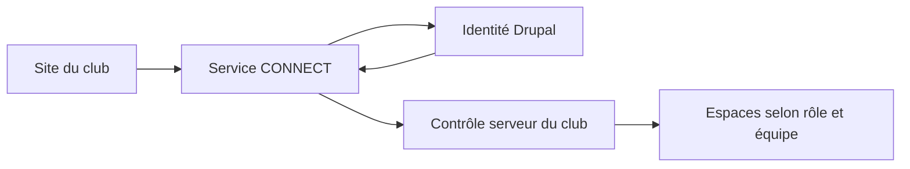

# Réutilisation de Drupal et CONNECT pour le club

## Demande et état de la décision

Le responsable souhaite étudier la même logique de connexion Drupal que CONNECT et bénéficier des évolutions communes. Le choix entre installation dédiée et raccordement à une installation existante reste **à déterminer ensemble**, conformément à sa réponse du 24 septembre 2026.

**Proposition : réutiliser un socle commun maintenu une seule fois, avec une configuration et des droits propres au club.** Cette proposition ne décide ni d'une instance commune, ni d'une migration, ni d'un déploiement. Le ZIP de présentation sur le sous-domaine reste indépendant de ce chantier et ne contient pas Drupal.

Le site peut rester sur `tclongages.fr` et déléguer la connexion à un fournisseur d'identité central. Le module Drupal s'installe dans le Drupal retenu : sa présence physique sur `tclongages.fr` n'est donc pas nécessaire dans une architecture centrale et n'est pas promise. Le site du club a, dans les deux cas, besoin d'un contrôle serveur de ses espaces privés.

## Sources inspectées et limites

Audit local en lecture seule le 24 septembre 2026, sans lecture de secrets, sans installation et sans requête vers les services hébergés. Aucun fichier AVEREO modifié.

La copie de référence examinée est `copie locale AVEREO_2/architecture-documentation-avereo`, HEAD `14f5759aff108662b3f0223e1045f80a71ea1689` daté du 24 septembre. Elle contient aussi des modifications documentaires préexistantes non commitées. L'autre copie `copie locale historique AVEREO` est plus ancienne, HEAD `905a061d752f534fd77ef873a322feac6b663ada` du 12 juillet, avec des descriptions historiques de SSO désactivé. Elle n'est pas utilisée pour conclure sur le code récent.

Les chemins abrégés ci-dessous sont relatifs à la copie de référence :

| Référence | Fichier et lignes observés | Constat |
| --- | --- | --- |
| C1 | `architecture-v1/avereo-app-connect/backend/src/Identity/OAuthFlow.php:24–115` et `119–166` | Authorization Code, PKCE S256, vérification de l'ID token signé, émetteur/audience/dates, concordance du sujet avec UserInfo. |
| C2 | `architecture-v1/avereo-app-connect/backend/src/Application.php:164–202` | Contrôle d'un compte approuvé et de son habilitation avant le lancement d'une application. |
| C3 | `architecture-v1/avereo-app-connect/backend/src/Security/AppLaunchTicketIssuer.php:39–63` et `66–94` | Ticket HMAC court lié à l'application et à l'identité ; destinations hébergées limitées à `avereo.fr` et ses sous-domaines. |
| C4 | `architecture-v1/avereo-app-connect/backend/src/Config.php:87–117` | Paramètres OAuth explicites et cinq applications déclarées : Rapport, Coupe, Projet, Thermo, Drone. Le club n'est pas déclaré. |
| C5 | `architecture-v1/avereo-app-connect/backend/src/Repository/PdoConnectRepository.php:86–108` et `281–311` | Droits liés aux organisations et applications ; la file des identités en attente de l'administration n'est toutefois pas filtrée par organisation. |
| C6 | `.github/scripts/prepare-connect-gate.mjs:4–27` | Le sas partagé est copié vers Projet/Thermo/Drone lors de la préparation. Il ne s'agit pas d'un code client automatiquement mis à jour sur les sites déjà déployés. |
| C7 | `architecture-v1/avereo-app-connect/integrations/drupal/README.md:3–59`, `avereo_identity_bridge/avereo_identity_bridge.module:38–55` | Pont Drupal pour activation/déconnexion et e-mails ; configuration privée, habillage et textes encore AVEREO. |
| C8 | `architecture-v1/avereo-platform/shared/connect-gate.php:148–185` et `235–244` | Cookie local et consommation d'un ticket ; ce sas générique ne transmet pas les droits métiers du club et ne remplace pas leur contrôle serveur. |
| T1 | [server/oidc-client.mjs](../server/oidc-client.mjs), lignes 39–59 et 83–105 | Expérimentation TCL : découverte OIDC, JWKS et contrôle du nonce attendu. |
| T2 | [server/settings.mjs](../server/settings.mjs), lignes 17–27 | Expérimentation TCL limitée à deux comptes Admin/Bureau ; pas de rôle Capitaine ni de périmètre d'équipe. |

Ces preuves établissent les mécanismes présents dans les sources, pas leur disponibilité publique, leurs versions réellement hébergées ou la compatibilité effective avec le club. Aucun test d'authentification réelle Drupal/CONNECT/club n'a été exécuté pour cette note.

## Trois responsabilités distinctes

1. **Drupal identifie la personne.** Il porte le compte et les mécanismes de connexion. CONNECT ne reçoit pas son mot de passe.
2. **CONNECT autorise l'accès aux applications.** Il porte le catalogue, les approbations et les habilitations. Le club pourrait devenir une application explicitement autorisée après adaptation et qualification.
3. **Le site du club applique ses règles métier.** Admin, Bureau et Capitaine, équipes autorisées, inscriptions et communications restent sous son contrôle serveur. L'accès à CONNECT ne doit jamais suffire pour lire un effectif ou agir sur une équipe.

Flux envisagé, **non implémenté pour le club** :

Les e-mails `tclongages@gmail.com` et `support@tclongages.fr` sont des adresses de contact ; ils ne créent aucun compte, rôle, droit Google ou droit CONNECT. L'authentification web ne donne pas non plus les autorisations nécessaires aux futures automatisations Google : comptes techniques ou consentements, périmètres et responsabilités seront à définir séparément.

## Ce qui peut bénéficier des développements communs

| Évolution | Effet possible pour le club | Action restant nécessaire |
| --- | --- | --- |
| Correction d'un service central de connexion déjà consommé | Disponible via le même service après son déploiement autorisé, si son contrat reste compatible. | Recette des parcours du club ; définir l'impact et le retour arrière avant publication du service commun. |
| Nouvelle fonction proposée par une API commune | Réutilisable si le club y est habilité. | Raccorder cette API, ses droits et son interface ; une fonction non consommée n'apparaît pas spontanément. |
| Composant, module ou bibliothèque partagé et versionné | Même correction réutilisable dans les deux produits. | Mettre à jour la version, reconstruire et déployer chaque application qui embarque ce code. |
| Écran ou fonction métier développé seulement dans CONNECT | Pas d'héritage automatique. | Le rendre explicitement commun ou adapter le parcours du club. |
| Copie autonome de CONNECT/Drupal pour le club | Même point de départ. | Organiser les mises à jour de cette instance ; une copie seule ne suit pas les évolutions du projet d'origine. |

Le principe recherché est donc **développer une fonction commune une fois, puis la consommer explicitement**, avec des versions et des tests. Il ne signifie pas déployer automatiquement tous les changements de CONNECT sur le site du club.

## Adaptations nécessaires avant une connexion réelle

- **Domaines et application :** ajouter une application club explicite avec une destination HTTPS exacte autorisée. C3/C4 empêchent actuellement son simple ajout par changement d'adresse. Prévoir des paramètres distincts pour test et production ; ne pas remplacer les domaines AVEREO ni ouvrir une redirection vers n'importe quel site.
- **Droits :** définir les personnes, le rôle club et les équipes autorisées. Le ticket actuel contient l'identité et l'application, pas l'organisation, les rôles Bureau/Capitaine ou les équipes. Une table de correspondance côté club ou un contrat d'autorisation adapté sera nécessaire ; aucun rôle ne sera déduit de la seule adresse e-mail.
- **Isolement :** qualifier comptes, approbations, administration, données et journaux. C5 montre qu'une organisation supplémentaire ne suffit pas à garantir le cloisonnement de toute l'administration actuelle. La file globale des identités en attente devra être traitée avant de donner un accès administratif du club à une instance commune.
- **Configuration propre :** secrets de lancement par application, sessions et cookies propres au site, stockage métier club séparé ou isolation démontrée. Si le club dialogue directement avec Drupal, prévoir son client OAuth et ses redirections propres. Aucun copier-coller de secrets AVEREO.
- **Parcours :** adapter les libellés et e-mails du pont d'identité, l'assistance, l'approbation, la récupération, la déconnexion et la révocation. Une révocation centrale doit être qualifiée aussi pour les sessions locales déjà ouvertes.
- **Compatibilité :** ne pas remplacer seulement l'URL du fournisseur dans l'expérimentation TCL. CONNECT utilise des endpoints explicites et une clé publique RS256 locale ; son code comporte une tolérance documentée pour un nonce absent. TCL utilise la découverte/JWKS et attend le nonce. Leur interopérabilité réelle avec la version Drupal retenue reste à tester, sans diminuer les contrôles pour forcer un résultat.
- **Exploitation :** vérifier hébergement PHP/BDD et extensions nécessaires, HTTPS, sauvegardes, supervision, mises à jour et personne responsable. Aucune infrastructure n'est choisie par cette note.

## Options à décider ensemble

| Option | Avantage | Conséquence à accepter ou traiter |
| --- | --- | --- |
| Services centraux Drupal/CONNECT, club comme application cliente | Davantage de fonctions communes exploitées au même endroit. | Dépendance de disponibilité, gouvernance commune et audit d'isolement à résoudre ; configuration actuelle insuffisante sans adaptation. |
| Mêmes modules versionnés, instance club dédiée | Données, administration et cycle de vie plus indépendants. | Hébergement et maintenance supplémentaires ; mise à jour explicite de chaque instance, pas d'héritage automatique. |

**Recommandation à examiner :** partir du socle et des contrats CONNECT pour éviter une seconde implémentation concurrente. Choisir ensuite l'instance physique selon l'indépendance souhaitée par le club et les résultats des tests d'isolement. Le raccordement central est une piste, pas une décision acquise ni une garantie de sécurité.

## Séquence proposée et critères de validation

1. Continuer la présentation statique du nouveau site sur le sous-domaine avec le paquet dédié ; aucune connexion réelle ni collecte privée.
2. Choisir avec le responsable l'option d'instance, l'hébergement, les rôles, les périmètres d'équipe, l'administration et les règles d'exploitation.
3. Préparer un raccordement isolé avec identités de test, application dédiée et données fictives ; relire le contrat avant toute modification du socle AVEREO.
4. Vérifier au minimum : anonyme refusé sur les espaces privés, compte non approuvé refusé, accès AVEREO seul insuffisant pour le club, accès club seul insuffisant pour AVEREO, séparation de deux équipes, URL directe, ticket expiré/rejoué, déconnexion, suspension et récupération. Qualifier l'impact d'une évolution du service commun sur les deux consommateurs.
5. Préparer le paquet de production et le retour arrière ; obtenir l'accord explicite pour les opérations d'hébergement et d'identité avant leur exécution.

La création de clients et secrets, la modification des droits, les migrations de base, le déploiement du pont Drupal, le changement DNS/HTTPS et l'ouverture des espaces sont des opérations sensibles futures. Chacune devra être présentée avec sa cible, son effet, son retour arrière et la décision attendue. Cette note n'en exécute aucune.

## État de vérification

- Confirmé : mécanismes et limites cités dans les fichiers locaux ouverts ; domaine et adresses confirmés par le responsable.
- Proposé : socle commun, application club et stratégie de réutilisation.
- À déterminer : instance dédiée ou commune, droits détaillés, isolation administrative, hébergement, maintenance, contrat et versions déployées.
- Non vérifié : état public Drupal/CONNECT, DNS/HTTPS du domaine, connexion réelle et réception du support.

Références de projet : [intégration V1](integration-officiel.md), [architecture](../architecture.md), [expérimentation OIDC](authentification-oidc.md), [commandes sensibles](commandes-sensibles.md).
