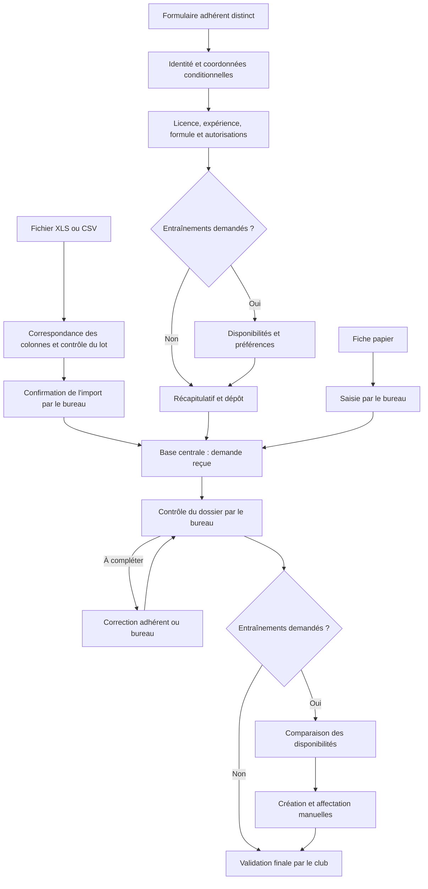

# Processus d'inscription pour la saison 2026-2027

Ce document reste la **proposition de fonctionnement cible à examiner**. Une visite fictive en montre désormais les écrans, sans service réel d'inscription. La page du prototype protégé sur le port 4173 reste un emplacement réservé, sans collecte. L'utilisateur a confirmé le 16 septembre 2026 le principe de **deux interfaces distinctes : formulaire adhérents et gestion privée du bureau**. Ce choix ne vaut pas accord d'ouverture au public.

Sources examinées : le [contexte et prompt fourni](../prompts/conception-inscriptions.md), la fiche [École de tennis, deux pages](<../../Inscriptions_adhérents/Design sans titre_20260904_124142_0000.pdf>) et la fiche [Adultes, une page](<../../Inscriptions_adhérents/Fiche d'inscription_adulte V2.pdf_20260904_124527_0000.pdf>). Les trois pages PDF ont été lues et inspectées visuellement. Le code et la documentation du prototype ont également été examinés. Les instructions contenues dans le prompt sont utilisées comme matériau de conception ; elles ne remplacent pas les décisions directes de l'utilisateur.

Les mentions **[À DÉCIDER PAR LE CLUB]**, **[PARAMÉTRABLE]** et **[PHASE ULTÉRIEURE]** signalent respectivement les décisions ouvertes, les réglages du futur outil et les fonctions exclues de cette première réalisation. Les obligations des champs ci-dessous sont des propositions métier, pas des obligations légales déduites des fiches.

## État de la visite et du service cible

| Périmètre | Disponible | Limite |
|---|---|---|
| Visite fictive `prototype/`, port 4174 | Formulaire en cinq étapes, tableau de dossiers, filtres, disponibilités et groupes d'exemple ; accès libre pour examiner le parcours. | Données fictives dans le navigateur, aucun compte, API métier, base centrale ou reprise sécurisée. |
| Échanges de fichiers dans la visite | Lot d'import XLS/CSV simulé, sans chargement de fichier ; export CSV des exemples. | Aucun import réel, lecteur de classeur ou export XLS livré. |
| Prototype protégé `dist/`, port 4173 | Pages du bureau contrôlées côté serveur ; page inscriptions en attente. | Accès fermé sans comptes réels, aucune collecte d'inscription. |
| Service réel cible décrit ci-dessous | Exigences et proposition de parcours. | À valider puis implémenter avant toute ouverture ou collecte. |

Voir le [guide de visite](visiter-prototype.md) et sa [recette dédiée](recette-demo.md). La visite isole les exemples sous `tcl.demo.inscriptions.v1`, avec les actualités sous `tcl.demo.communication.v1`. Ses horaires et groupes sont fictifs et marqués comme exemples ; les tarifs relevés dans les fiches et les décisions encore ouvertes ci-dessous restent inchangés. Facebook, WhatsApp et copie de messages y sont simulés, sans transmission des données d'inscription.

## 1. Synthèse du processus cible

Une personne dépose une demande par saison, pour elle-même ou pour un enfant. Elle choisit une formule souhaitée et indique si elle veut participer aux entraînements. Si oui, elle déclare plusieurs possibilités horaires, sans réserver de cours. Le bureau contrôle le dossier ; la référente compose et affecte les groupes manuellement. Le club finalise l'inscription après ses contrôles administratifs.

Les fiches papier continuent d'être reçues et sont saisies par le bureau dans **la même base**. Une famille peut avoir plusieurs dossiers utilisant la même adresse de contact : l'email ne constitue pas l'identifiant d'un adhérent.

Dans le service cible, la page privée `inscriptions.html` devient l'outil de suivi et la page distincte `adherer.html` accueille le formulaire. Ces deux écrans sont montrés dans la visite fictive, sans être raccordés à un service réel. Les informations d'inscription, les coordonnées et les disponibilités ne sont jamais relayées automatiquement vers Facebook ou WhatsApp. La page Communication conserve son parcours propre.

Première version réelle visée : saisie web et papier, import/export XLS et CSV réservé au bureau, disponibilités, contrôle des dossiers, constitution manuelle des groupes, suivi administratif des règlements hors ligne. L'import/export a été demandé explicitement par l'utilisateur après la première proposition. Paiement en ligne, emails/SMS automatiques, OCR et affectation automatique sont exclus. Les simulations de visite ne doivent pas être présentées comme une réalisation de cette version complète.

## 2. Diagramme global du parcours

Les saisies web, papier et imports utilisent les mêmes validations de données. L'API n'accepte pas d'un déposant les champs réservés au bureau : paiement reçu, groupe, statut final ou commentaire interne. Un fichier importé ne déclenche pas non plus de validation administrative automatique.

## 3. Parcours détaillé de l'adhérent

| Étape | Objectif | Utilisateur | Système proposé | Club | Données générées |
|---|---|---|---|---|---|
| 0. Préparer la campagne | Ouvrir une saison cohérente. | Aucune action. | Garde le formulaire fermé tant que la configuration n'est pas validée. | Valide formules, tarifs, dates, autorisations et plages. | Configuration de saison versionnée. |
| 1. Identifier la personne | Créer le bon dossier. | Renseigne nom, prénom, naissance et personne effectuant la demande. | Adapte le parcours adulte/mineur ; ne déduit pas la catégorie sportive du seul nom d'une formule. | Confirme les règles d'âge. | Identité, date de référence, type de déposant. |
| 2. Contacter | Disposer des coordonnées pertinentes. | Adulte : ses coordonnées et un contact d'urgence. Mineur : coordonnées de son ou ses responsables légaux. | Réutilise le responsable comme contact principal si choisi, sans ressaisie. | Contrôle les cas particuliers. | Coordonnées, liens aux responsables, contact d'urgence. |
| 3. Décrire la pratique | Aider à choisir une formule et un groupe. | Indique licence antérieure, dernière année si connue, expérience et formule souhaitée. | Affiche le tarif de référence et les éléments restant à confirmer. | Confirme formule et tarif final. | Déclarations et référence de formule. |
| 4. Déclarer les souhaits | Distinguer adhésion seule et entraînements. | Répond à la question centrale ; renseigne ses possibilités si oui. | Masque les disponibilités si non ; signale les contradictions avec une formule de cours. | Traite les demandes sans plage compatible. | Demande d'entraînement, disponibilités, contraintes. |
| 5. Relire et déposer | Éviter les erreurs avant réception. | Répond aux autorisations applicables, relit et dépose. | Contrôle à nouveau côté serveur ; crée un dossier une seule fois ; affiche référence et moyen de reprise. | Voit un dossier reçu, pas automatiquement validé. | Identifiant, horodatage, source, révision et réponses versionnées. |
| 6. Compléter et organiser | Régler les manques et organiser les cours. | Corrige les disponibilités avant échéance ; échange manuellement avec le club si nécessaire. | Signale les modifications et les incompatibilités. | Contrôle, constitue les groupes et enregistre les règlements reçus hors ligne. | Historique minimal, affectation, suivi administratif. |
| 7. Finaliser | Confirmer la décision du club. | Consulte le résultat de son dossier. | Ne finalise pas seul une inscription. | Valide les critères requis puis informe par ses moyens habituels. | Statut final, auteur et date. |

Le message de dépôt doit dire : « Votre demande a été reçue. Le club doit encore la vérifier. Les disponibilités indiquées ne réservent pas un cours. » Aucun email de confirmation automatique n'est prévu.

## 4. Structure complète du formulaire

### Formules et tarifs lus dans les fiches

Ce tableau est un relevé documentaire, **pas un catalogue déjà activé**. Les références courtes servent à la conception ; les libellés commerciaux et montants proviennent des fiches.

| Référence proposée | Libellé de la fiche | Prix lu | Point à vérifier |
|---|---|---|---|
| `mini-tennis` | Mini-Tennis (5-7 ans) | 110,00 € | Date de référence des âges. |
| `initiation` | Initiation (7-15 ans) | 130,00 € | Date de référence et critères de niveau. |
| `perfectionnement` | Perfectionnement (8-18 ans) | 130,00 € | Critères d'accès. |
| `perfectionnement-plus` | Perfectionnement + (8-18 ans) | 130,00 € | Différence avec Perfectionnement. |
| `adhesion-jeunes` | Adhésion Jeunes (-18 ans hors école de tennis) | 40,00 € | Compatibilité avec une demande de cours. |
| `cours-adultes` | Cours Adultes ou adultes competition | 125,00 € ou 150 € | **Règle de choix absente : aucun montant sélectionné automatiquement.** |
| `adulte-competition` | Adhésion Adulte compétition | 100,00 € | Articulation avec cours et licence. |
| `adulte-loisirs` | Adhésion Adulte loisirs | 70,00 € | Articulation avec une demande de cours. |
| `pass-ete` | Pass été (Juin-Août) | 50,00 € | Année et dates exactes ; case remise noire, sens à confirmer. |

**[À DÉCIDER PAR LE CLUB]** Le calcul du « Forfait famille » n'est pas décrit. Ne calculer aucune remise automatique. La durée des cours, la capacité des groupes, les dates de campagne et l'inclusion éventuelle de la licence dans ces montants ne sont pas établies par ces documents. Ne pas créer de variantes de formules pour expliquer les 125/150 € sans validation.

### Champs et responsabilités

Stockage proposé : `personne`, `contact`, `inscription`, `pratique`, `autorisation`, `disponibilite`, `suivi_club`. « Oui proposé » reste à valider par le club. Les PDF ne précisent pas systématiquement les champs obligatoires.

| Section | Champ | Type | Obligatoire proposé | Condition d'affichage | Stockage |
|---|---|---|---|---|---|
| Campagne | Saison | Lecture seule | Oui, système | Toujours | inscription.saison |
| Déposant | Pour moi / pour un mineur | Choix | Oui | Début | inscription.type_deposant |
| Identité | Civilité Mme / M. | Choix facultatif | Non ; utilité à confirmer | Adulte ou mineur | personne.civilite |
| Identité | Nom | Texte | Oui proposé | Toujours | personne.nom |
| Identité | Prénom | Texte | Oui proposé | Toujours | personne.prenom |
| Identité | Date de naissance | Date | Oui proposé | Toujours | personne.date_naissance |
| Adulte | Nom de jeune fille | Texte | Non ; libellé « nom de naissance » proposé à valider | Adulte, si pertinent | personne.nom_naissance |
| Coordonnées | Adresse | Texte | Oui proposé | Toujours | personne.adresse |
| Coordonnées | Code postal | Texte | Oui proposé | Toujours | personne.code_postal |
| Coordonnées | Ville | Texte | Oui proposé | Toujours | personne.ville |
| Contact principal | Email | Email | Oui proposé pour le web ; saisie papier sans email possible par le bureau | Adulte ou responsable choisi | contact.email |
| Contact principal | Téléphone | Téléphone | Un numéro proposé | Adulte ou responsable choisi | contact.telephone |
| Mineur | Email/téléphone propres à l'enfant | Email/téléphone | Non ; collecte à justifier | Seulement si retenue par le club | contact de l'enfant |
| Responsable légal | Qualité père / mère / tuteur ou autre qualité à préciser | Choix | Oui proposé pour le responsable renseigné | Mineur | lien_responsable.qualite |
| Responsable légal | Nom, prénom | Deux textes | Au moins un responsable proposé ; règle exacte à valider | Mineur | personne + lien_responsable |
| Responsable légal | Téléphone fixe, portable, email | Téléphones/email | Au moins un moyen utilisable ; pas tous obligatoires | Mineur | contact du responsable |
| Responsable légal | Ajouter un autre responsable | Action conditionnelle | Non par défaut | Mineur | Autre lien, sans imposer deux parents |
| Urgence | Nom, prénom de la personne à joindre | Textes | Oui proposé adulte ; réutilisation d'un responsable pour mineur | Selon parcours | contact_urgence |
| Urgence | Téléphone fixe / portable | Téléphones | Au moins un proposé | Contact renseigné | contact_urgence |
| Licence | Déjà licencié : oui/non | Choix | Oui proposé | Toujours | pratique.deja_licencie |
| Licence | Dernière année de licence | Année ou « inconnue » | Conditionnel ; inconnue admise avec contrôle | Si oui | pratique.derniere_annee_licence |
| Expérience | Nombre d'années de pratique | Entier positif ou nul / inconnu | Réponse proposée | Toujours | pratique.annees_pratique |
| Expérience | Niveau déclaré facultatif | Liste à définir | Non ; complément proposé, absent des fiches | Si utile aux groupes | pratique.niveau_declare |
| Formule | Formule souhaitée | Liste issue du catalogue validé | Oui proposé | Selon règles de campagne | inscription.formule_souhaitee_ref |
| Formule | Prix de référence | Lecture seule | Calcul serveur si univoque | Formule choisie | Référence/version de formule |
| Autorisations | Mesures en cas d'urgence | Oui/non explicite + identité du signataire | Réponse à prévoir ; effet d'un refus à décider | Mineur, texte validé | autorisation type urgence |
| Image | Prise de photos | Oui/non explicite | Réponse distincte ; pas de oui précoché | Mineur, selon texte de la fiche | autorisation type prise_photo |
| Image | Diffusion des photos | Oui/non explicite | Distinct de la prise de photos | Mineur, périmètre validé | autorisation type diffusion_photo |
| Autorisations | Lieu, date, identité/qualité du signataire et preuve | Texte/date/référence de pièce | Modalité à décider | Autorisations applicables | autorisation + preuve |
| Entraînement | Souhaitez-vous participer aux cours / entraînements organisés par le club ? | Oui/non | Oui proposé | Toujours | inscription.entrainement_demande |
| Disponibilités | Réponse pour chaque plage | Non renseigné / indisponible / disponible / préféré | Réponse ou signalement de manque | Si entraînement oui | disponibilite |
| Disponibilités | Aucune plage proposée ne convient | Choix explicite | Non | Si entraînement oui | inscription.aucune_plage_compatible |
| Disponibilités | Souplesse : horaires stricts / ajustement à discuter | Choix | Non | Si entraînement oui | inscription.souplesse |
| Disponibilités | Contraintes/commentaires d'organisation | Texte court | Non | Si entraînement oui | inscription.contraintes |
| Dépôt | Information sur l'utilisation des données | Texte visible | Affichage obligatoire dans la conception | Avant dépôt | Version de notice |
| Dépôt | Récapitulatif et correction | Lecture/actions | Oui | Avant dépôt | Pas de copie supplémentaire |

Les textes d'autorisations des fiches mentionnent une signature. Une case web ne sera pas présentée comme leur équivalent juridique automatiquement. **[À DÉCIDER PAR LE CLUB]** Conserver temporairement la signature papier et son contrôle, ou faire valider la modalité numérique avant réalisation. Ne pas inventer une autorisation adulte absente de la fiche.

### Données automatiques et bureau

| Responsable | Informations |
|---|---|
| Système | Identifiant opaque, saison, date de dépôt, dates de modification, révision, provenance déduite du canal, âge calculé à une date affichée, état des disponibilités. |
| Bureau uniquement | Statut du dossier et motifs, formule confirmée, montant de référence confirmé, remise famille motivée, total, règlements constatés, date/mode du règlement, référence de chèque et banque si nécessaires, numéro de licence vérifié, date de saisie dans le système fédéral si c'est le sens confirmé du champ papier, groupe, niveau évalué et commentaire interne. |
| Adhérent | Ses déclarations et ses réponses d'autorisation ; consultation en lecture seule de son statut et de son groupe. Aucune modification du statut administratif, des règlements constatés ou de l'affectation ; aucun accès aux commentaires internes. |

La « saisie sur internet » figurant sur les fiches est ambiguë. Elle ne doit pas être assimilée sans confirmation à la date de dépôt du formulaire ni à un appel API Ten'Up. Aucune intégration Ten'Up n'est prévue ici.

## 5. Gestion des disponibilités

La campagne contient une liste **[PARAMÉTRABLE]** de plages : identifiant stable, jour, début, fin, saison, version et état actif. Aucun horaire réel n'est inventé dans cette proposition. Le fuseau de travail est `Europe/Paris` ; la date limite et son heure sont affichées explicitement.

Sur téléphone, présenter un jour à la fois avec des cartes de plages et trois boutons libellés « Indisponible », « Disponible », « Préféré ». Une carte sans réponse reste **« Non renseigné »**, distinct d'un refus. « Préféré » compte comme disponible. Plusieurs choix sont possibles ; aucune disponibilité d'un autre adhérent n'est visible.

Pour aider à terminer : bouton « Marquer les plages restantes indisponibles » avec récapitulatif, puis confirmation. Si toutes les plages sont impossibles, l'utilisateur peut déposer une demande avec « Aucune plage proposée ne convient » ; le bureau reçoit une alerte, pas une fausse disponibilité.

Une grille incomplète ne rend pas le dossier affectable. Le club décide si le dépôt avec grille partielle reste autorisé ; proposition : l'accepter pour éviter de perdre une demande, avec un indicateur de complément nécessaire. Une plage modifiée par le club conserve son historique ; elle n'est pas silencieusement remplacée sous le même identifiant.

## 6. Tableau de pilotage de la référente

La page privée présente quatre vues : **Dossiers**, **Disponibilités**, **Groupes**, **Paramètres de saison**. Les droits de paramétrage sont limités aux membres désignés, pas nécessairement à tout le bureau.

Vue Dossiers : compteurs reçus/à compléter/finalisés, puis tableau limité à nom-prénom, âge et catégorie, formule, entraînement, résumé des disponibilités, état du dossier, groupe et alerte. Ouvrir une ligne affiche coordonnées, responsables, urgence, licence/expérience, autorisations, provenance, suivi du règlement et commentaire interne. Les détails sensibles ne remplissent pas le tableau principal.

Filtres : saison, adulte/jeune, tranche d'âge, formule, expérience/niveau, entraînement demandé, jour/plage disponible ou préférée, état du dossier, affecté/non affecté, modifications à revoir et source web/papier/autre. La vue Disponibilités peut comparer un petit ensemble de joueurs compatibles ; le téléphone utilise des listes, pas une grille horizontalement interminable.

Actions : **Créer depuis une fiche papier**, **Importer un fichier**, **Exporter la sélection**, ouvrir/corriger un dossier, demander un complément par contact manuel, examiner une modification, affecter à un groupe et finaliser. Les exports sont réservés au bureau habilité et restent privés. Ils ne remplacent pas la base comme source de vérité.

### Import et export XLS / CSV

**Exigence du service réel confirmée, non implémentée.** Prévoir l'import **et** l'export en `.xls` et `.csv`. La visite fournit seulement le lot d'import simulé et l'export CSV des exemples décrits plus haut. La compatibilité `.xlsx` est également proposée, en complément ; elle ne remplace pas le format `.xls` demandé. Un export XLS doit être un véritable classeur, jamais un CSV renommé. La bibliothèque sera choisie pendant la réalisation après vérification de ces formats et de sa maintenance.

**Parcours d'import proposé :**

1. Télécharger un modèle ou sélectionner un fichier existant, puis préciser la saison et les feuilles du classeur à traiter.
2. Associer les colonnes aux champs du dossier. Signaler les colonnes/feuilles ignorées et vérifier le séparateur et l'encodage CSV dans l'aperçu.
3. Présenter les ajouts, mises à jour, doublons et erreurs, avec feuille/ligne/colonne et correction attendue. Un rapport privé peut être téléchargé.
4. Examiner les différences pour chaque dossier existant. Une cellule vide signifie « ne pas modifier » ; un effacement nécessite une action explicite dans l'aperçu. L'absence d'une ligne ne supprime jamais un dossier.
5. Corriger les erreurs bloquantes ou exclure explicitement les lignes concernées, puis **confirmer le lot retenu**. L'analyse seule ne modifie rien. Le serveur revérifie droits, données et révisions ; un conflit oblige à refaire l'aperçu.
6. Appliquer le lot retenu dans une transaction : succès complet ou aucune écriture. Conserver identifiant du lot, auteur, date, compteurs et références modifiées. Un double clic ou une reprise réseau ne réimporte pas le lot. Présenter le bilan final.

Le rapprochement utilise d'abord l'identifiant stable du dossier et sa saison, sans dispenser des contrôles de droits et de cohérence. Sans identifiant, les ressemblances d'identité/naissance/saison sont des **doublons possibles à examiner**, jamais une fusion automatique sur l'email. Contrôler aussi les doublons internes au fichier. Un réimport ignore les lignes inchangées et présente les conflits avant écriture.

Les nouveaux dossiers importés restent à contrôler. Statut final, affectation, règlement reçu, tarif validé et commentaire interne sont signalés et exclus de l'import standard ; ces décisions passent par les actions privées habituelles. Les autorisations importées sont des déclarations à vérifier, pas une preuve de signature. Les changements de disponibilités déclenchent les mêmes alertes de réexamen que la saisie manuelle.

**Exports :** choisir saison, dossiers filtrés et colonnes utiles ; afficher périmètre et nombre de lignes avant téléchargement. Distinguer une liste de consultation, pouvant inclure des champs bureau autorisés en lecture seule, du modèle destiné à être réimporté. Exclure mots de passe, codes de reprise, sessions et secrets de tous les exports. Aucun envoi externe n'est associé au téléchargement.

Les données répétées utilisent des tables liées par identifiants : inscriptions, responsables légaux, contacts d'urgence et disponibilités. Un classeur peut comporter plusieurs feuilles ; un échange CSV complet utilise plusieurs fichiers nommés et présentés ensemble dans le lot. Une liste simple reste un seul CSV. Ne pas concaténer plusieurs responsables ou plages dans une cellule libre non réimportable. L'aperçu vérifie les liens et exclut toute ligne enfant dont le parent a été écarté.

Les modèles seront versionnés : colonnes, types, liens, saison, références de formules/plages et valeurs autorisées. Préserver comme texte les téléphones, codes postaux, licences et identifiants, avec leurs zéros initiaux. Export CSV proposé en UTF-8 avec point-virgule ; vérifier les variantes reçues avant import. Les dates ambiguës ne sont pas devinées. « Non renseigné » reste distinct de « non » ou « indisponible ».

Ne pas exécuter les macros, formules ou liens externes des fichiers. Signaler les cellules calculées et demander une copie contenant des valeurs. Refuser avec explication les fichiers chiffrés, corrompus ou hors limites annoncées, sans troncature silencieuse. Typer les textes dans les classeurs exportés et protéger les CSV contre l'interprétation en formules ; documenter cette transformation et tester son réimport. OWASP indique qu'aucune protection CSV universelle ne convient à tous les tableurs : de simples guillemets ne suffisent pas à garantir la sécurité. [Référence OWASP](https://community.owasp.org/attacks/CSV_Injection).

Préparer une sauvegarde privée cohérente avant un lot de mises à jour. Une restauration éventuelle est une opération distincte qui doit préserver les changements intervenus depuis. La conservation des fichiers et rapports privés est à définir. Ajouter `mode_saisie = import_fichier` et l'identifiant du lot ; préserver la provenance papier/web connue et vérifiée, sinon retenir `source_inscription = autre` avec précision du bureau. La base centrale demeure la référence.

**À préciser lors de la réalisation :** colonnes définitives, limites taille/lignes, variantes CSV reçues et compatibilité Excel/LibreOffice. Aucun fichier réel d'adhérents n'est importé pendant cette conception.

## 7. Processus de création des groupes

1. Filtrer la saison, les demandes d'entraînement et les dossiers suffisamment renseignés.
2. Sélectionner une catégorie d'âge et des niveaux compatibles, selon des règles décidées par le club.
3. Afficher les disponibilités communes et compter les réponses préférées, sans affecter personne automatiquement.
4. Vérifier professeur, terrain, capacité et durée **[PARAMÉTRABLE]**, sans supposer ces ressources disponibles.
5. Créer manuellement le groupe : libellé, jour, début, fin, encadrement et capacité.
6. Affecter les personnes après contrôle de capacité, de doublon, de chevauchement avec un autre groupe et de couverture de **toute la durée du cours** par leurs disponibilités. Une simple intersection de quelques minutes ne suffit pas.
7. Enregistrer la décision, la révision de disponibilités examinée et son auteur. Un cas incompatible exige résolution ou dérogation motivée du club, jamais une correction silencieuse des souhaits.

Une place préférée ne constitue ni une priorité automatique ni une garantie. Si plusieurs groupes par personne sont nécessaires, cette cardinalité doit être confirmée ; le modèle peut conserver plusieurs affectations sans les autoriser d'emblée dans l'interface.

**[PHASE ULTÉRIEURE]** Une aide algorithmique pourrait utiliser âge de référence, niveau, disponibilités versionnées, capacités et contraintes d'encadrement. Aucune suggestion IA ni agent de regroupement n'est conçu maintenant.

## 8. Statuts d'une inscription

Éviter un seul long parcours obligeant un adhérent sans cours à attendre une affectation. Proposer deux dimensions, huit valeurs au total :

| Dimension | Valeur | Sens et transition |
|---|---|---|
| Dossier | Reçu | Dépôt enregistré ; contrôle du bureau à faire. |
| Dossier | À compléter | Le bureau identifie les informations ou éléments manquants. |
| Dossier | Finalisé | Décision explicite du club après contrôle ; auteur et date conservés. |
| Dossier | Annulé | Retrait constaté par le bureau ; motif conservé. Aucun effacement implicite. |
| Entraînement | Sans entraînement | Aucune grille ni affectation exigée. |
| Entraînement | Disponibilités à compléter / à examiner | Motif « Réponse manquante » : action de l'adhérent ; motif « Aucune plage compatible » : réponse complète, action du club. |
| Entraînement | À affecter | Disponibilités exploitables, pas encore de groupe actif. |
| Entraînement | Affecté | Affectation existante ; une alerte peut demander sa révision. |

L'état entraînement est calculé à partir des données et affectations ; il ne valide pas le dossier administratif. Les indicateurs « À revoir » et « Conditions administratives manquantes » ne sont pas de nouveaux statuts.

**[À DÉCIDER PAR LE CLUB]** Critères de finalisation : informations requises, vérification des autorisations, formule et tarif confirmés, état du règlement hors ligne, licence et, si cours demandés, affectation examinée. Le système explique les blocages ; le simple dépôt ou une somme déclarée par l'adhérent ne prouve pas un paiement.

## 9. Gestion des modifications

Proposition sans emails automatiques : après dépôt, afficher une référence non secrète et un **code personnel de reprise aléatoire**, à conserver. La page « Retrouver ma demande » échange référence + code contre une session limitée à ce dossier. Le code n'est pas le numéro de dossier, un nom, une naissance ou l'email ; seul son dérivé est stocké côté serveur.

Le code est révocable et expire selon la campagne **[PARAMÉTRABLE]**. Les tentatives sont limitées, les erreurs ne révèlent pas si un dossier existe, les sessions expirent et le bouton de déconnexion les ferme. Le secret ne doit pas figurer dans les URL, journaux ou exports. Code perdu ou dossier papier : le bureau vérifie la demande par son processus de contact puis réémet un accès ; aucun rétablissement automatique sur simple connaissance d'une date de naissance. Les principes de secret aléatoire, stockage protégé et expiration s'appuient sur [OWASP](https://cheatsheetseries.owasp.org/cheatsheets/Forgot_Password_Cheat_Sheet.html) ; leur adaptation en code de reprise renouvelable est une proposition du projet, pas une prescription de cette source.

Avant l'échéance, l'adhérent modifie ses disponibilités. Pour la première version, les corrections d'identité, de formule ou d'autorisations passent par le bureau : elles peuvent modifier les conditions du dossier. Après l'échéance, les disponibilités sont en lecture seule ; le bureau peut corriger sur demande avec un motif tracé. Ces droits sont contrôlés par le serveur.

Chaque changement incrémente une révision et enregistre acteur, date et nature de l'action. Deux modifications concurrentes ne s'écrasent pas : une révision ancienne provoque une demande de relecture.

Après affectation, la modification conserve le groupe et affiche « À revoir ». Si les nouvelles plages sont incompatibles ou si l'entraînement n'est plus demandé, la référente décide du maintien ou du retrait. Une finalisation précédente porte également une alerte jusqu'à examen. Aucun changement automatique de groupe, de prix ou de règlement.

## 10. Modèle de données

| Entité proposée | Rôle et données principales | Relations |
|---|---|---|
| Saison | Libellé, ouverture, clôture, échéance des disponibilités, règles d'âge validées, version de configuration. | Formules, plages, groupes et inscriptions. |
| Personne | Nom, prénom, naissance et coordonnées nécessaires. Un responsable peut être lié à plusieurs enfants. | Inscription et liens de responsabilité. |
| Responsabilité légale | Personne représentée, responsable, qualité, contact principal. | Deux personnes, données applicables au dossier. |
| Inscription | Personne, saison, formule souhaitée/confirmée, entraînement demandé, contraintes, source, état, dates, révision. | Une inscription active par personne et saison, hors historique des annulations. |
| Pratique déclarée | Licence antérieure, dernière année connue, expérience, niveau déclaré/évalué distingués. | Inscription de saison ; numéro confirmé réservé au club. |
| Contact d'urgence | Contact relié à une personne existante ou fiche minimale distincte. | Inscription ; ne pas recopier les coordonnées d'un responsable déjà présent. |
| Formule de saison | Référence, libellé exact, prix univoque ou cas à confirmer, conditions et version. | Inscription ; un montant confirmé garde sa référence historique. |
| Plage proposée | Saison, jour, début/fin, version, état actif. | Disponibilités ; désactiver une ancienne plage plutôt que réutiliser son identifiant. |
| Disponibilité | Inscription, plage/version, réponse et date. | Unicité inscription + plage/version ; absence distincte d'indisponible. |
| Groupe | Saison, libellé, horaires, capacité, ressources validées. | Affectations. |
| Affectation | Inscription, groupe, état actif/retiré, auteur/date et révision examinée. | Historique des décisions de la référente. |
| Autorisation | Type, réponse, texte/version, signataire, qualité, date et référence de preuve si nécessaire. | Inscription et personne habilitée ; prise de photo et diffusion séparées. |
| Suivi administratif | Montant confirmé, remise motivée, règlements constatés et références nécessaires, licence vérifiée, notes internes. | Inscription ; consultation et modification selon habilitation. |
| Accès et trace | Compte bureau, session ou dérivé de code de reprise, droits, expiration ; journal minimal séparé. | Accès à un dossier ou fonctions bureau, révocation et auteurs des actions. |
| Lot d'import | Identifiant, modèle/version, format, saison, auteur/date, état et bilan ; fichier temporaire privé. | Références des dossiers traités et révisions ; pas de deuxième base d'adhérents. |

Ne pas stocker l'âge comme valeur durable à maintenir : le calculer avec une date de référence affichée. Conserver les décisions de saison, tarifs appliqués et textes d'autorisation sans les réécrire lorsque la configuration future change. Une éventuelle conservation historique de coordonnées doit avoir un besoin justifié.

Détecter les doublons possibles par saison, identité et naissance, avec décision humaine de rapprochement. Ne jamais fusionner deux enfants parce qu'ils partagent un email. Une relance réseau du même dépôt doit être idempotente, pour ne pas créer deux demandes.

## 11. Exemple JSON d'une inscription

L'[exemple JSON fictif](../api/inscription-exemple.json) représente un adulte choisissant l'adhésion loisirs, sans entraînement. Le tarif de 70 € demeure dans le catalogue à confirmer ; il n'est pas envoyé comme autorité par le navigateur. Aucune plage horaire réelle, aucun code d'accès ni donnée de véritable adhérent n'est inventé.

Le fichier sépare `demande`, qui illustre les données d'entrée, de `enregistrement_serveur`, qui illustre les métadonnées ajoutées par le serveur. Ce dernier bloc ne doit jamais être accepté tel quel depuis un formulaire public ou un futur OCR. C'est un exemple de conception, **pas un contrat API final ni un fichier à importer dans le prototype**. Le contrat détaillé et sa validation seront écrits après accord sur les champs.

## 12. Architecture HTML / JavaScript / Node.js

Conserver HTML/CSS/JavaScript sans framework. Le navigateur gère les étapes, les champs conditionnels et les résumés. Node.js valide chaque écriture, contrôle les droits et la date limite, calcule les métadonnées et accède à la base. Le tableau bureau interroge cette même API, sans copier toute la base dans `localStorage`.

| Interface cible, non implémentée | Responsabilité |
|---|---|
| Lecture de configuration publique | Fournir seulement formules publiables, plages actives, textes validés et dates. |
| Dépôt d'une demande | Accepter uniquement les champs autorisés, limiter les abus, valider et créer une fois. |
| Reprise d'un dossier | Vérifier le secret, ouvrir une session limitée, autoriser seulement lecture propre et modifications prévues. |
| Liste/détail/correction bureau | Exiger un compte habilité et filtrer les champs selon son rôle. |
| Groupes et affectations | Contrôler capacités, révisions et compatibilités ; enregistrer l'auteur. |
| Configuration et exports | Réservés aux responsables autorisés. |
| Analyse et application des imports | Bureau habilité ; aucune écriture à l'analyse, contrôle des doublons et confirmation avant transaction. |

Avant toute collecte réelle : HTTPS, sessions serveur et cookies sécurisés, contrôle d'autorisation pour chaque action et chaque dossier, protection des écritures contre les requêtes forgées, requêtes SQL paramétrées, limites de taille et de fréquence, logs sans secrets. Les fonctions bureau peuvent être limitées à gestion des inscriptions, organisation des groupes et administration des accès, sans créer d'usine à rôles.

Le serveur protégé du port 4173 écoute seulement sur cet ordinateur ; sa protection HTTP Basic et l'absence de comptes réels restent inchangées. Le serveur de visite sur le port 4174 est distinct, sans authentification et réservé aux données fictives. Les endpoints ci-dessus, la base, les sessions adhérents et l'authentification hébergée **n'existent pas encore**. Vérifier d'abord les possibilités réelles de l'hébergement o2switch, les versions disponibles, le stockage persistant et les sauvegardes ; ne pas présumer qu'un dépôt de HTML suffit.

## 13. Comparaison des solutions de stockage

| Option | Avantages | Limites | Évolution et proposition |
|---|---|---|---|
| Fichier JSON | Lisible, très simple pour des jeux fictifs et échanges. | Concurrence, transactions, contrôles de relations et récupération à développer. | Format d'échange utile ; éviter comme base partagée principale. |
| SQLite côté serveur | Base transactionnelle légère, sans service de base séparé. | Un seul écrivain à la fois ; fichier persistant local au serveur, accès via l'API et sauvegarde cohérente nécessaires. | **Recommandation provisoire** si un unique service Node dispose d'un disque adapté. |
| MySQL/MariaDB, si proposé par l'hébergeur | Service distinct, adapté à plusieurs connexions ; intégration possible aux sauvegardes hébergeur. | Configuration, accès et maintenance à vérifier ; davantage de composants. | Alternative si elle simplifie réellement l'exploitation sur l'hébergement retenu. |

SQLite documente son usage pour les sites de trafic faible à moyen et ses limites d'écriture concurrente et d'accès direct par un système de fichiers réseau. La recommandation ci-dessus en est une application au contexte supposé du club, à confirmer après examen de l'hébergement. [Documentation SQLite](https://sqlite.org/whentouse.html).

La base doit être hors du répertoire public et ne doit pas être partagée en direct par les navigateurs, par OneDrive ou comme fichier réseau entre bénévoles. Les sauvegardes restent privées, chiffrées selon le dispositif retenu, avec restauration testée sur copie et fréquence/durée **[À DÉCIDER PAR LE CLUB]**. Aucun stockage central ni service métier n'est installé ; le stockage local d'exemples de la visite ne les remplace pas.

## 14. Compatibilité future avec les fiches papier et l'agent IA

Première version : fiche reçue → recherche d'un éventuel doublon → saisie bureau dans le formulaire commun → contrôle des données et autorisations → base centrale, `source_inscription = papier`.

**[PHASE ULTÉRIEURE]** Photo → extraction → vérification humaine → objet `demande` normalisé → même validation Node.js → même base. Le schéma peut accueillir une version, une référence de document privée et un mode de saisie distinct (`manuel` aujourd'hui, autre mode ultérieurement). La provenance reste « papier », même si une machine extrait ensuite le texte.

L'opérateur vérifie les champs incertains avant intégration. Une extraction ne valide ni signature, ni paiement reçu, ni affectation, ni identité. Les photos éventuelles restent privées et leur conservation doit être définie. Aucune reconnaissance d'image, API IA ou collecte de photos n'est réalisée maintenant.

## 15. Recommandations UX mobile

Prévoir cinq écrans courts : **Personne**, **Pratique et formule**, **Entraînements**, **Autorisations**, **Vérification**. Les responsables légaux sont une section conditionnelle du premier écran. Le troisième est réduit à la question oui/non si aucun cours n'est demandé.

Indiquer « Étape 2 sur 5 », proposer retour/suivant sans perte des saisies pendant le parcours, des libellés persistants, erreurs près des champs et boutons d'au moins 44 px. Utiliser claviers email/téléphone/date appropriés, navigation clavier, focus visible et états jamais exprimés par la couleur seule.

Les disponibilités utilisent des cartes verticales par jour. Le récapitulatif indique le nombre de plages disponibles/préférées, les réponses manquantes et la mention « choix définitif par le club ». Sur téléphone, le tableau bureau devient une liste de dossiers ouvrables.

Pour cette première conception, aucune sauvegarde persistante de données personnelles dans `localStorage` n'est proposée. Les étapes conservent les données en mémoire jusqu'au dépôt ; avertir avant de quitter. Une reprise de brouillon avant dépôt serait une fonction supplémentaire à décider, distincte du code de reprise fourni après réception.

## 16. Points de vigilance et décisions attendues

| Sujet | Proposition et décision nécessaire |
|---|---|
| Données personnelles | Définir finalités, personnes habilitées, information affichée, rectification et conservation avant collecte. Collecter les données utiles uniquement. |
| Mineurs | Adapter le parcours à la situation réelle des responsables ; ne pas imposer deux parents. Valider signataires et justificatifs réellement nécessaires. |
| Photos et communication | Séparer prise de photo et diffusion. Les supports cités dans la fiche jeunes sont presse locale, sites du club/de la FFT/de la ville et affichage au club house. **Facebook et WhatsApp ne sont pas explicitement nommés : aucune autorisation pour ces canaux ne doit être déduite.** |
| Autorisations | Valider textes, traitement des refus et preuve attendue. Proposer que le refus de diffusion d'image n'empêche pas à lui seul le dépôt de la demande. |
| Santé/urgence | Distinguer contact et autorisation d'urgence d'un dossier médical ; aucun diagnostic ou questionnaire de santé n'est ajouté par défaut. |
| Accès bureau | Confirmer les personnes, leurs fonctions et leurs droits. Contrôler l'accès aux données et aux exports, pas seulement aux pages. |
| Corrections | Historique minimal des actions importantes, gestion des conflits, possibilité de retrait ; aucune suppression en masse implicite. |
| Sauvegardes | Désigner un responsable, définir fréquence/conservation et tester une restauration avant ouverture. |
| Communication externe | Aucun dossier, commentaire, contact ou grille de disponibilités ne part vers les réseaux sociaux. Pas d'emails/SMS automatiques dans cette version. |

La CNIL invite les structures sportives à identifier les finalités, les données nécessaires, les destinataires, l'information des personnes, la conservation et les mesures de sécurité. Ces sujets doivent être validés par le club ; cette proposition ne déclare pas une conformité juridique et n'invente aucune durée légale. [Référence CNIL pour le sport amateur](https://www.cnil.fr/fr/sport-amateur-hors-contrat/tester-votre-conformite-au-rgpd/collecte).

Décisions métier prioritaires : règle des 125/150 €, remise famille et cas du Pass été, critères des formules, dates et horaires, champs obligatoires, modalités d'autorisation, finalisation et gestion des cas sans cours compatible. Le principe « formulaire adhérents distinct + gestion bureau privée » est déjà confirmé ; il n'est pas à redemander.

## 17. Plan de mise en œuvre

| Phase | Livrable à examiner | Condition avant la suite |
|---|---|---|
| 1. Fixer les règles | Dictionnaire des champs, catalogue validé, règles de disponibilité et de finalisation, contrat JSON commun et modèles XLS/CSV. | Réponses du club aux ambiguïtés ; aucune donnée réelle requise. |
| 2. Valider les écrans | Visite fictive disponible : formulaire et page bureau, cas adulte/mineur et sans cours. | Retours de l'utilisateur et contrôles de visite consignés ; aucune acceptation métier implicite. |
| 3. Préparer le service | Choix d'hébergement et stockage vérifiés, API, sessions, droits, sauvegardes et contrat de données. | Revue des accès, contrôles et restauration sur données fictives. |
| 4. Relier les parcours | Formulaire, saisie papier, imports/exports XLS et CSV, disponibilité, tableau et groupes manuels branchés à la même base de recette. | Tests complets avec personnes fictives et plusieurs comptes de recette. |
| 5. Faire la recette club | Scénarios ci-dessous, contrôle des textes et absence de données privées dans la vitrine. | Corrections terminées et résultat concret présenté. |
| 6. Préparer puis ouvrir | Cible précise, configuration, sauvegarde, plan de retour arrière et procédure d'exploitation. | **Accord explicite de l'utilisateur avant mise en production et collecte réelle.** |

Scénarios de recette du service réel à prévoir : adulte sans cours ; mineur avec un responsable ; plusieurs enfants au même email ; cours sans plage compatible ; grille partielle ; formule contradictoire ; prix adulte ambigu ; doublon papier/web ; second clic de dépôt ; modification après affectation ; deux corrections concurrentes ; échéance passée ; accès à un autre dossier refusé ; export non autorisé refusé ; code perdu/révoqué ; restauration d'une sauvegarde ; affichage mobile et clavier. La [recette de visite](recette-demo.md) précise les parcours fictifs effectivement testés ; elle ne valide pas les scénarios d'API, d'accès, de transaction ou de restauration du service réel non implémenté.

Recette des fichiers à prévoir : véritables XLS en entrée/sortie ; CSV avec accents, séparateurs, guillemets et retours à la ligne ; zéros initiaux ; dates/montants ambigus ; doublons internes et réimport inchangé ; champs bureau exclus ; feuilles non prises en charge signalées ; annulation sans écriture ; erreur de transaction sans import partiel ; conflit de révision ; liens entre feuilles/fichiers ; formules/macros sans exécution ; export puis réimport sans altération silencieuse des champs autorisés. Ajouter les essais XLSX si ce format complémentaire est retenu.

Les opérations sensibles seront présentées en décisions concrètes : « donner accès à ces membres », « importer ces dossiers après contrôle des doublons », « remplacer la base après sauvegarde » ou « ouvrir le formulaire à cette adresse ». Les cibles, effets, risques et retour arrière seront préparés avant demande d'accord, selon [la procédure du projet](commandes-sensibles.md). Cette proposition n'exécute aucune de ces opérations.

Contrôle documentaire de la conception initiale : rapprochement des champs et tarifs avec les trois pages PDF, séparation des états proposés et existants, vérification du JSON fictif, des liens internes et des métadonnées. La présente actualisation distingue les écrans fictifs ajoutés des services réels non implémentés ; elle ne modifie ni les tarifs relevés ni leurs réserves, ni le prompt d'origine.

**PROCHAINE ÉTAPE RECOMMANDÉE**

Parcourir la visite fictive et valider le **dictionnaire des champs et les règles métier**, en commençant par les tarifs ambigus, les autorisations et les disponibilités. Stabiliser ensuite le modèle de données commun et les écrans acceptés avant de réaliser puis relier l'API, les accès et la base.
